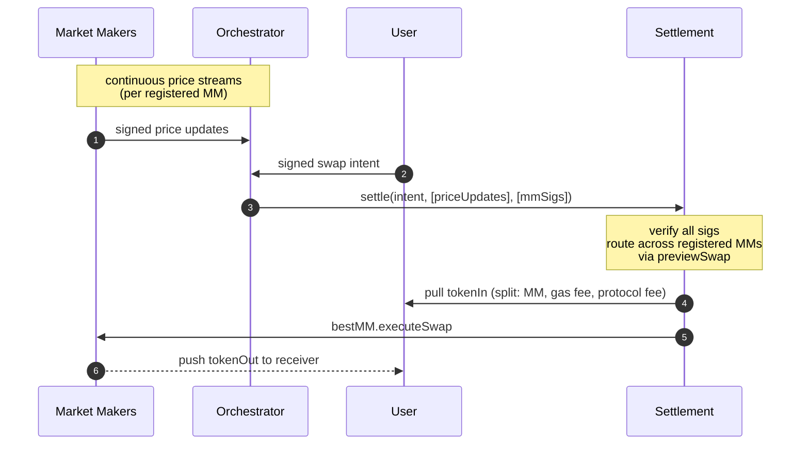

# propAMM Architecture Overview

A coordinated settlement layer for proprietary market makers on EVM L2s. Market makers publish signed prices through an off-chain orchestrator and settle on-chain through a shared settlement contract. Each market maker keeps proprietary pricing, inventory, and counterparty logic in its own contract. The shared layer handles intent routing, signature enforcement, fund movement, and atomic execution.

In v1, the settlement contract supports **multi-MM routing**: multiple market makers can co-exist on the same settlement contract and the contract picks the best `amountOut` per order automatically. Users sign one intent; the contract picks the filling MM.

This document describes the conceptual model, the on-chain and off-chain components, the trust boundaries, and the benefits the protocol delivers to market makers. It does not cover implementation specifics — only what an integrator needs to reason about the system.

## The layered model

The design separates concerns into two layers, with a clean interface between them.

### Layer 1 — Shared settlement substrate

A single deployed contract per chain, identical for every market maker. Its job:

- Verify the user's signed intent and every market maker's signed price.
- Pull the user's `tokenIn` using whichever approval mode they signed (standard ERC-20 approve, ERC-2612 permit, Permit2 witness-bound, or EIP-3009 receive-with-authorization).
- Track the latest signed price per `(market maker, tokenIn, tokenOut)` and reject settlements against stale ones.
- Route each intent to the best MM by polling `previewSwap` across all registered providers that support the pair, then hand off to the winning provider for the actual fill.
- Keep funds atomic — the contract acts as a pure proxy: `tokenIn` flows user → MM inventory directly, `tokenOut` flows MM inventory → recipient directly. The settlement contract never holds a non-zero balance at rest.
- Enforce single-use user intents, monotonic market-maker nonces, deadlines, and an optional exclusivity window.
- Isolate failures per intent — one bad fill emits an event and the rest of the batch continues.

This layer is open and verifiable. Every market maker uses the same one; users sign against the same domain regardless of who fills them.

### Layer 2 — Market-maker provider contract

A contract each market maker deploys themselves. It implements a small interface the settlement contract calls into during every routing decision and every fill. Inside this contract the market maker is free to do anything:

- Apply curve-based price padding or spread.
- Filter counterparties by whitelist, blacklist, or any custom predicate.
- Maintain freshness checks against the anchor price using their own logic.
- Manage inventory across pairs.
- Apply per-pair fill caps or risk limits.
- Decline an order (return 0 from `previewSwap`) for any reason without reverting.

The settlement contract has no knowledge of, and no opinion on, what the provider does inside. The provider can return any output amount (subject to the user's `minAmountOut` floor) or revert; the settlement contract handles both outcomes safely.

## Multi-MM routing

The settlement contract maintains an owner-curated registry (capped at 32 entries) of registered MM provider contracts. For every user intent, settlement iterates the registry, calls each provider's `supportsPair` to filter, polls `previewSwap` on the survivors, and routes the order to the MM offering the highest `amountOut`. Routing happens in the same transaction as the fill — there is no off-chain auction or pre-trade negotiation.

Key properties:

- **Users don't pin an MM.** The signed intent specifies the pair and constraints; the contract picks the filling MM.
- **MMs compete on price.** A provider that returns a higher `previewSwap` for a given `(tokenIn, tokenOut, netAmountIn, anchorPrice)` wins the order. Returning 0 declines cleanly.
- **Anchor namespace is per-MM.** Each market maker's stored prices are isolated. Another MM committing on the same pair does not overwrite or interact with your anchor state.
- **Lazy commit.** Only the price updates actually consumed by the routing decisions in a batch get written to storage. Redundant or stale commits no-op cheaply.
- **Per-intent failure isolation.** Each intent runs inside a self-call wrapped in try/catch. A failure emits `IntentFailed(intentHash, errorSelector, reason)` with a 4-byte selector that downstream watchers use to decide retry-vs-drop. The user's nonce is not consumed on a failure, so the same signed intent can be re-submitted byte-for-byte on a later block.

## How a fill happens

A user signs one swap intent: what they want to trade, the floor they will accept, and the deadline. The orchestrator pairs that intent with one or more fresh signed prices from registered MMs and submits a settlement transaction. The settlement contract verifies, routes, moves funds, and emits the result — all atomically in one transaction.

The market makers publish signed prices continuously. The orchestrator includes the relevant signed updates as calldata in the settlement transaction. The contract runs the routing loop — `supportsPair` then `previewSwap` per registered MM — picks the winner, pulls `tokenIn` from the user (split between MM inventory, the gas-fee recipient, and any protocol fee), and calls the winning provider's `executeSwap`. The provider pushes `tokenOut` directly to the recipient. Multiple intents that arrive close together can settle in one batched transaction, each routed independently to whichever MM has the best price for its pair and size.

If any step fails for a single intent, the chain unwinds that intent only (an `IntentFailed` event is emitted with a 4-byte error selector); the rest of the batch continues. The user's nonce remains free for retry.

## Settlement modes

The intent's `feeAmount` field controls who pays settlement gas. With `feeAmount > 0`, the orchestrator submits the settle transaction and recovers gas from the user's input token; the user signs one message and never holds ETH. With `feeAmount = 0`, the user or aggregator submits the settle transaction themselves and pays gas in ETH. The `executor` and `exclusivityDeadline` fields let the signer grant a specific submitter first-look during a chosen window, for flows that need it.

---

## Benefits for market makers

Working with Biconomy to build propAMM delivers the following benefits to every market maker, regardless of strategy or operational model:

1. **On-chain protections** — atomic, signature-enforced settlement with same-block freshness enforcement and replay protection on every fill.
2. **Minimised trust model** — trust concentrates on your signing key; every other component is either signature-enforced, reentrancy-bounded, or non-privileged.
3. **Operations and cost predictability** — a hardened, load-validated orchestrator with lossless retry, parallel-safe execution, and well-understood per-fill costs.
4. **Security** — settlement contract with a deliberately minimal owner control surface and standard defensive patterns throughout.
5. **Off-chain participation** — market makers publish signed price updates over WebSocket; everything they do is off-chain signed payloads.
6. **Quoting competitively** — fast price updates and freshness enforcement reduce adverse selection, letting you quote tighter spreads with confidence.

---

### On-chain protections

Three classes of checks fire on every fill, atomically inside the same transaction.

**Atomicity.** User funds never move without the winning provider delivering at least the user's `minAmountOut`. If the provider reverts for any reason, the per-intent try/catch unwinds that fill; the user's funds are returned in the same EVM revert. The settlement contract acts as a pure proxy — there is no intermediate state where funds are in limbo.

**Signature enforcement.** Every market-maker-side payload — streaming price update — is EIP-712 verified against the signing key before any on-chain state changes. Forgery is impossible at the protocol layer. Signature verification works transparently across EOAs, EIP-1271 smart wallets, and EIP-6492 counterfactual wallets.

**Freshness.** The settlement contract enforces, on every fill, that the on-chain anchor was committed in the same block as the swap. There is no user-tunable staleness tolerance; the contract requires `block.number == anchor.commitBlock` and reverts otherwise. The MM-signed `expiresAt` adds a wall-time cap on top.

Two paths satisfy the same-block requirement: either the settle transaction itself commits a fresh MM-signed PriceUpdate, or another settlement in the same block has already committed the freshest signature and this transaction settles against that anchor. If neither is available for a given MM, that MM is skipped in routing for this intent.

This enforcement eliminates the largest class of toxic flow, which uses signatures from prior blocks. It does not eliminate intra-block staleness: within a single block, multiple MM signatures may exist and CEX prices can drift between them. An adversary fast enough to land first with a slightly-stale-but-still-current-block signature can fill at a price that has moved relative to live markets. The residual exposure is bounded by the MM's inter-signature interval (typically 200 to 500 ms at 5 to 10 Hz publishing cadence). Closing this last gap requires within-block ordering control, which sits at the sequencer layer.

**Replay protection.** Every signed payload carries a nonce. User intents are single-use (bitmap nonce). Market-maker prices are strictly monotonic per `(mm, tokenIn, tokenOut)`; older-nonce price commits become no-ops on-chain so parallel settlement workers race safely, while same-nonce-different-content always reverts.

**Exclusivity.** Users can optionally pin a specific executor for a chosen window — useful for granting first-look to a trusted operator. The check is `tx.origin`-independent, so contract-account batching and account-abstraction flows work correctly.

---

### Minimised trust model

| Party | Worst case if compromised | What they cannot do |
|---|---|---|
| **User** | Spam-submit intents (rate-limited at intake) | Harm other users or market makers |
| **Market maker** | Refuse to fill; sign stale prices (caught by signed expiry) | Drain user funds — settlement enforces `minAmountOut` atomically inside reentrancy guard; cannot reuse another MM's signature (per-MM namespaced anchor) |
| **Market-maker provider contract** | Revert any fill | Reenter the settle path; manipulate another MM's anchor; act on a price not signed by its MM |
| **Orchestrator** | Censor specific intents; choose ordering between two valid matches | Forge user or market-maker signatures; drain funds; pick a winning MM the contract doesn't have whitelisted |
| **Relayer transaction sender** | Waste its own gas | Drain user or market-maker funds (no token allowances) |
| **Settlement contract owner** | Pause settlement; register/unregister MMs; set fee parameters; transfer ownership (two-step) | Upgrade the contract; withdraw user or market-maker funds (no such functions exist) |

The integration architecture deliberately concentrates trust in one place: the market maker's signing key. Every other component is either signature-enforced, reentrancy-bounded, or has no privileged authority over funds.

---

### Operations and cost predictability

**Operational hardening.** The protocol is designed to handle real-world failure modes without losing intents or compromising soundness.

- **Parallel-safe.** Multiple settlement workers can submit transactions concurrently against the same chain without producing race-induced reverts. Older-nonce price commits no-op safely on-chain.
- **Lossless retry on transient failure.** Every submitted transaction is tracked through to chain receipt. Failed intents emit `IntentFailed(intentHash, errorSelector, reason)`; the 4-byte selector tells the watcher whether to retry next block (transient) or drop (terminal) — no re-simulation required. Nonces are not consumed on `_settleOne` failures, so the same signed intent can be re-submitted byte-for-byte.
- **Bounded retry on persistent failure.** A deterministically-reverting intent is dropped after a configurable retry budget, with operator metrics indicating which intent and why. Stops runaway gas spend on poison flow.
- **Batched settlement with per-intent isolation.** Multiple intents settle in one transaction with independent try-catch boundaries per intent. One bad fill doesn't block the rest of the batch.
- **Multi-RPC failover.** Primary RPC errors fall over to secondary endpoints automatically; persistent errors propagate to the operator.

**Measured throughput (preliminary).** One orchestrator instance, one `(market maker, pair)` slot, settles **310 intents per second** on a Base-class L2 in the orchestrator-mediated path users take, with **100% on-chain settlement** and **zero on-chain reverts**. Per settled intent at 5-intent batches: **~80,000 gas** on chain. At 310 intents/sec per slot, the slot uses about **16% of Base's per-second gas budget** at current parameters — plenty of room above this number, easy to scale up and fill more blockspace from here.

Multi-MM routing adds approximately 5k gas for `supportsPair` per registered MM plus 5–10k for `previewSwap` per MM that supports the pair. At 4 MMs per pair, per-order routing overhead is around 40k on top of the baseline.

**Predictable costs.** A settle transaction has two cost components measured from on-chain receipts in the load tests:

- **Fixed per batch** (paid once per transaction, regardless of how many intents are in it): commits the latest MM-signed `PriceUpdate`s as on-chain anchors. About 50,000 gas and 150 bytes of calldata, totaling approximately **$0.0018** per committed MM at current Base mainnet gas (L1 base fee 0.4 gwei, ETH $2,000).
- **Per intent (variable)** (paid for each intent in the batch): verify the user's signature, run freshness gates, route across MMs, pull funds, call the winning provider, deliver output, emit event. About 70,000 gas and 760 bytes of calldata, totaling approximately **$0.0074** per intent at current conditions.

A transaction with N intents costs `$0.0018 × M committed MMs + N × $0.0074`. At the load-test batch density of 5 intents per transaction, that works out to about **$0.008 per intent** average. Under sustained load batches grow naturally (10 to 20 intents); per-intent cost approaches the variable floor of $0.0074. The price-update share of per-intent cost is about $0.00036 at N=5 (5% of total) and drops below 2% at N=20.

The orchestrator pays this gas in ETH from a relayer pool and recovers it from the user's `feeAmount` in the input token. Per-intent cost scales linearly with L1 gas conditions; at typical Ethereum activity levels (5 gwei L1), per-intent cost is about $0.097 in a 5-intent batch. The measured per-slot rate sits well above any realistic adoption level: at 310 intents/sec, a single slot draws roughly 16% of Base mainnet's per-second gas budget. The chain has multiples more headroom; scaling further is an infra-side change.

---

### Security

The settlement contract is designed with a minimal control surface and standard defensive patterns throughout:

- **Reentrancy guards** on every state-mutating entry point. **Solady SafeTransferLib** for all token movement. **Pause kill-switch** for operator-side incident response.
- **Two-step ownership transfer** prevents accidental control loss.
- **No upgrade path. No withdrawal path.** The settlement contract cannot drain user or MM funds under any owner action. The owner can pause, register/unregister MMs, set fee parameters, and transfer ownership; nothing else.
- **EIP-712 + EIP-1271 + EIP-6492** for signature verification, works with EOA wallets, smart-account wallets, counterfactual (not-yet-deployed) wallets, and HSM-backed signing infrastructure with no protocol-level distinction.
- **Pure proxy** — settlement never holds tokens at rest. `tokenIn` flows user → MM inventory + fee recipients in independent `transferFrom`s; `tokenOut` flows MM inventory → recipient inside the provider's `executeSwap`. No intermediate hop through settlement; no zero-balance-at-end invariant to be off-by-one about.

---

### Off-chain participation

Market makers publish signed price updates over a WebSocket connection. Payloads are signed off chain and consumed by the settlement contract at fill time.

The market maker's infrastructure footprint is a WebSocket connection and a signing process. EIP-712 plus EIP-1271 / EIP-6492 mean the signing path works the same for EOA wallets, smart-account wallets (deployed or counterfactual), and HSM-backed signing infrastructure.

---

### Quoting competitively

Market makers are protected from adverse selection by the protocol's design, which allows them to quote tighter, more competitive rates.

Two mechanisms drive this:

**Fast price updates with freshness enforcement.** The streaming channel is designed for high-cadence price publication — 5–50 Hz typical, higher supported. The contract requires every fill to settle against an anchor committed in the current block, which closes the prior-staleness vector that most permissionless L2 propAMMs leave open. Residual intra-block exposure (CEX drift between consecutive MM signatures within the same block) still requires some spread padding on volatile pairs, but the structural reduction from unbounded prior staleness to bounded intra-block residual is material.

**Selective counterparty and order control.** Through the provider contract, market makers retain full control over which traders they fill, at what sizes, with what padding. The defensive reference implementation supports whitelists, bps-based spread curves, and per-pair fill caps — all enforced atomically on-chain, not just off-chain. A provider that doesn't want a particular order returns 0 from `previewSwap` and the router skips it cleanly. This selective exposure reduces the adverse selection surface further: the market maker is not quoting to the entire world on equal terms unless they choose to.

---

## Boundaries — what the protocol does not do

- **Does not price your inventory.** The market-maker provider contract returns `amountOut`; the protocol's only check is that it satisfies the user's `minAmountOut`.
- **Does not filter counterparties.** Whitelisting, blacklisting, KYC gates, or any other counterparty policy lives inside the market-maker provider contract.
- **Does not bound fill sizes.** The market maker enforces per-pair caps in its own contract.
- **Does not hedge.** Inventory management and external hedging are the market maker's responsibility.
- **Does not pin a specific MM per intent.** The user signs an intent; the contract routes per-order across registered MMs based on `previewSwap`. Pinning a single MM was an explicit non-goal for v1.
- **Does not support native ETH directly.** Wrapped tokens (WETH) only.

## Standards and references

- **EIP-712** typed-data signatures for every signed payload (user intent, streaming price update).
- **EIP-1271 / EIP-6492** signature verification supported transparently — smart-account wallets (deployed or counterfactual) and contract-backed market-maker signing keys work with no protocol-level distinction from EOAs.
- **Permit2** supported as one of four approval modes available to users (the others being standard ERC-20 approve, ERC-2612 permit, and EIP-3009 receive-with-authorization). Permits are bound to the specific intent via the canonical witness pattern.
- **EIP-3009** `receiveWithAuthorization` supported for USDC-style tokens; per-intent nonce derivation collides with the token-level nonce on replay.
- **ERC-8211-style** anchor-freshness predicates enforced at the settlement contract level: every fill requires `block.number == anchor.commitBlock` and reverts otherwise.

## Summary

The protocol is a thin shared substrate for atomic, signature-verified, per-order multi-MM-routed settlement plus a per-market-maker proprietary layer for pricing and policy. Trust concentrates on the market-maker signing key; every other surface is either bounded or non-privileged. Operational hardening — race safety, lossless retry, bounded poison handling, multi-RPC failover — is in the substrate and the orchestrator, not the integrator's concern. Market makers bring pricing and inventory; the protocol handles everything around it.

Integration details — what to deploy, what to sign, and the wire format — are covered in the companion integration document.
