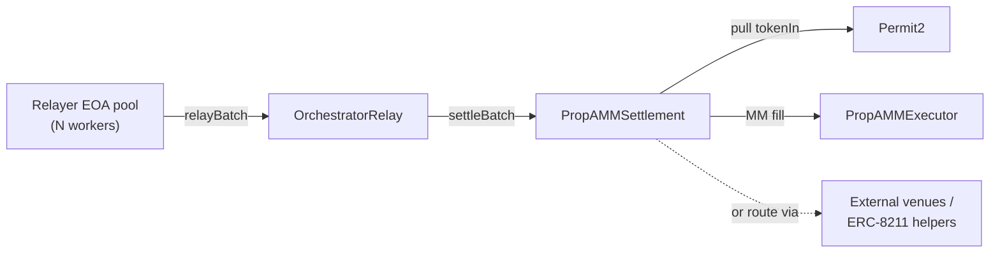

# PropAMM Architecture

PropAMM is an intent-based settlement protocol for streaming-priced market makers on EVM L2s. A trader signs ONE EIP-712 message. An orchestrator builds the calldata that achieves the trader's intent at the best price. Settlement enforces a single guarantee — the receiver gets at least `minAmountOut` of `tokenOut`, or the intent reverts.

## The single signature

Every swap is one EIP-712 signature: a Permit2 `PermitWitnessTransferFrom` whose witness is the `Intent` struct.

```
Intent {
    address trader        // signer
    address receiver      // where tokenOut goes
    address tokenIn
    uint256 amountIn
    address tokenOut
    uint256 minAmountOut  // floor; settlement-enforced
    address executor      // who can submit; 0 = anyone
    uint256 deadline
    uint256 nonce         // Permit2 nonce
}
```

The wallet renders it legibly. The signature authorises:
- Permit2 to pull up to `amountIn` of `tokenIn` (once)
- The intent's semantics (receiver, tokenOut, minAmountOut, deadline)
- The executor binding (`msg.sender` must equal `intent.executor`, or `intent.executor == 0` for permissionless)

No second tx is required from the trader. A one-time Permit2 approval per `tokenIn` (or a signed EIP-2612 permit chained into the same tx for first-time users) is the only setup.

## The settle entry

```
PropAMMSettlement.settleBatch(
    Step[]   preHook,           // runs once per batch (e.g. commit MM PriceUpdates)
    Intent[] intents,
    Step[][] perIntentSteps     // calldata that fulfils each intent
)
```

A `Step` is `(to, value, data, isDelegatecall)`. Settlement is generic — it doesn't know about MMs, executors, or venues. It enforces:

1. `msg.sender == intent.executor` (or `executor == 0`)
2. `block.timestamp <= intent.deadline`
3. Per-intent `try/catch` — a revert in one intent doesn't roll back adjacent intents
4. Receiver balance snapshot: `receiver.balanceOf(tokenOut)` delta must be ≥ `intent.minAmountOut`
5. Delegatecall step targets must be on an owner-managed whitelist

The preHook runs once per batch and is NOT isolated — a revert in the preHook aborts the whole batch. Its primary use is to commit fresh MM PriceUpdates to anchors before the per-intent dispatch.

## The components



Settlement is the hub: relayer EOAs reach it through `OrchestratorRelay`, it pulls `tokenIn` through Permit2, and it dispatches each intent's `Step[]` to `PropAMMExecutor` (streaming MM), external venues (Uniswap, Curve), ERC-8211 composable-execution helpers (owner-allowlisted delegatecall), or any mix.

### PropAMMSettlement

Generic intent-batch dispatcher. Holds zero standing approvals. Per-intent try/catch. Owner-managed delegatecall whitelist. Receiver-snapshot delivery floor.

### PropAMMExecutor

Streaming-MM module. Two narrow entry points:
- `updatePrices(PriceUpdate[], bytes[])` — permissionless, idempotent. Commits MM-signed PUs to per-`(mm, tokenIn, tokenOut)` anchors. Same-block freshness: `anchor.commitBlock == block.number`.
- `fillFromAnchor(provider, tokenIn, tokenOut, amountIn, receiver)` — reads the freshly-committed anchor, computes `amountOut = amountIn * price / 1e18`, grants exact-amount approval to the MM provider, invokes `IMMProvider.executeSwap`, then revokes. No standing approvals.

### OrchestratorRelay

Fronting contract for the orchestrator's pool of relayer EOAs. Users sign `intent.executor = OrchestratorRelay` once at quote time; the orchestrator rotates through N relayer EOAs in parallel behind that one address. `msg.sender == OrchestratorRelay` regardless of which underlying EOA submitted, so the executor binding holds without re-signing on key rotation.

### MM provider (IMMProvider)

A small (~100 LoC) contract each MM deploys. Two functions:
- `signer()` — returns the address whose key signs PriceUpdates. EOA or EIP-1271.
- `executeSwap(...)` — gated by `msg.sender == approvedExecutor`. Pulls `amountIn` of `tokenIn` from the executor and sends `amountOut` of `tokenOut` from the MM's inventory to the receiver.

There is no protocol-side MM registry. The orchestrator's off-chain routing decides which MMs see flow.

## What gets composed inside Step[]

Settlement's generic `Step[]` dispatch is what makes the protocol composable. Any combination works:

**Streaming-MM happy path (the production default):**
```
preHook: [updatePrices(PUs, sigs)]
steps:   [Permit2.permitWitnessTransferFrom,
          tokenIn.transfer(executor),
          PropAMMExecutor.fillFromAnchor]
```

**External venue:**
```
preHook: []   // no anchor needed if route is venue-only
steps:   [Permit2.permitWitnessTransferFrom,
          tokenIn.approve(UniswapRouter),
          UniswapRouter.exactInputSingle(receiver=intent.receiver),
          tokenIn.approve(UniswapRouter, 0)]
```

**Mixed route — half through PropAMM MM, half through Uniswap:**
```
steps: [Permit2 pull,
        transfer half to PropAMM executor,
        fillFromAnchor for first half,
        approve Uniswap for second half,
        Uniswap swap for second half,
        revoke Uniswap approval]
```

**ERC-8211 composability (fee split via runtime balance read):**
```
steps: [Permit2 pull,
        transfer tokenIn to PropAMM executor,
        fillFromAnchor — delivers tokenOut to SETTLEMENT (not user!),
        delegatecall ComposableExecutionModule.executeComposableDelegateCall([
            transfer(FEE_COLLECTOR, FIXED_FEE),
            transfer(USER, balanceOf(SETTLEMENT, tokenOut))  // runtime read
        ])]
```

The delegatecall target (ERC-8211 module) must be on the owner-managed whitelist. The runtime balance read resolves to settlement's actual balance at execution time, so the user gets exactly `(totalOut - FEE)` regardless of slippage. Settlement holds zero residual after sweep.

## Trust model

| Layer | Protects against | How |
|---|---|---|
| Permit2 witness binding | Cross-user drain via standing approvals to settlement | Users never approve settlement directly; only Permit2. Each per-intent sig binds the exact `(token, amount, intent)`. |
| Signed executor field | MEV hijack of orchestrator-built calldata | `msg.sender == intent.executor` check per intent. Permissionless settle (executor=0) is opt-in by trader. |
| Per-intent try/catch | One bad intent poisoning the batch | External self-call rolls back the failed intent's state changes; other intents proceed. |
| Receiver snapshot | Misrouted output, underdelivery | `receiver.balanceOf(tokenOut)` delta must be ≥ `intent.minAmountOut`, else revert. |
| Delegatecall whitelist | Arbitrary delegatecall takeover of settlement | Only owner-allowlisted addresses can be delegatecall targets. |
| Same-block anchor freshness | Stale price front-runs | `PropAMMExecutor` requires `anchor.commitBlock == block.number` per fill. |
| Monotonic PU nonce | Cross-block PU replay | `PropAMMExecutor` rejects non-monotonic PriceUpdates per `(mm, tokenIn, tokenOut)`. |

## Three relay modes

| Mode | `intent.executor` | Who submits | Use case |
|---|---|---|---|
| Orchestrator-relayed | `OrchestratorRelay` address | One of N relayer EOAs the orchestrator owns | Default UX; gasless from the trader's perspective |
| Self-relay | trader's own EOA | Trader's wallet submits `settleBatch` directly | Trader wants no orchestrator dependency |
| Permissionless | `address(0)` | Anyone | Trader opts in to MEV exposure for guaranteed inclusion |

Self-relay supports two sub-patterns:
- **Self-PU**: trader builds preHook with their own signed PU (signed by an MM key the trader has authority over, or queried from an MM via off-chain RFQ). Works 100% reliably.
- **Piggyback**: trader submits with empty preHook and relies on a recent orchestrator-committed anchor. Works only when the trader's tx lands in the same block as an orch batch tx. Reliable when the pair has continuous orchestrator activity; intermittent otherwise.

## Orchestrator surplus

The trader signs `minAmountOut` as the floor. Anything above that delivered to the receiver is surplus. The orchestrator's quote engine sizes the route expecting some `quoted_output > minAmountOut`; the orchestrator's calldata routes the spread to its revenue collector (typically via a final Step that transfers exactly `minAmountOut` to the receiver and the remainder to the collector).

Signed-executor binding ensures the orchestrator captures the surplus, not an MEV bot. A compromised relayer EOA bounds attacker gain per intent to the same spread. Permit2 bounds the per-intent pull amount.

## What the protocol does NOT do

- No on-chain MM registry. The orchestrator's off-chain routing decides which MMs see flow.
- No protocol-side approval to user tokens. All pulls go through Permit2.
- No baked-in protocol fee. Fees are calldata Steps the orchestrator includes.
- No native I/O wrapper. ETH input is self-relayed (user sends `msg.value`); orchestrator's first step is `WETH9.deposit{value: amountIn}`.
- No allowlist on `settleBatch`. The per-intent executor binding is the only access control.

## Reference

- Protocol source: `bcnmy/propamm-protocol`
- Public docs site: `bcnmy/propamm-protocol-docs` (this repo)
- ERC-8211 composability standard: <https://erc8211.com/>
- ERC-8211 SDK: `@biconomy/smart-batching`
