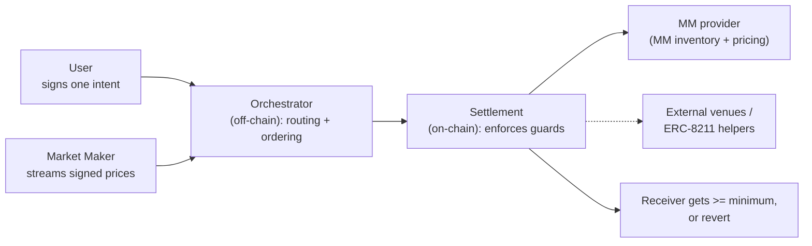

# PropAMM Architecture

PropAMM is an intent-based settlement layer for streaming-priced market makers on EVM L2s. A user signs one message. A market maker streams signed prices. Everything in between, routing, ordering, gas, and settlement, is handled for them. The settlement layer guarantees one thing: the user receives at least the minimum they signed for, or nothing moves.

This is a high-level overview. For what an MM implements, see the [integration guide](./integration.md).

## Three ideas

### One signature, full abstraction

A user signs a single EIP-712 intent: the token they are selling, the amount, the token they want, and the minimum they will accept. That is the entire user-facing surface. They do not pick a route, choose a market maker, send transactions, or hold gas.

A market maker signs and streams prices over a WebSocket. That is the entire MM-facing surface. They do not send transactions or pay gas either.

Between those two signatures, our orchestrator builds the route off-chain and our settlement contracts execute it on-chain. The user's one approval, ever, is a one-time Permit2 approval per token, or a signed permit folded into the same transaction for first-time users.

### ERC-8211 routing with the user's guards built in

For each intent we build the execution using ERC-8211 composable calldata. This is what lets a single intent be fulfilled by a proprietary market maker, an external venue, a split across both, or a composed flow such as a fee split that reads balances at execution time. The route is chosen for best execution.

The user's protections travel inside that execution and are enforced by the settlement contract:

- The receiver must end up with at least the signed minimum, or the whole intent reverts.
- Token pulls are bounded by exactly what the user signed, through Permit2. The settlement contract never holds a standing approval to user funds.
- Composable steps can only touch targets we explicitly allow.
- Each intent in a batch is isolated. One failing intent reverts on its own and does not affect the others.

### Same-block price freshness, enforced on-chain

The settlement layer enforces, on every market-maker fill, that the price it settles against was committed on-chain in the same block. We always commit the latest signed price first, in the same block, before the intent settles against it. A stale price cannot be used.

This is enforced as a standard of EVM execution, checked deterministically by every node on the normal settle path, rather than as a custom block-builder service that depends on a particular builder winning the block. There is no MEV-Boost dependency and no builder market to maintain. This is what closes the cross-block stale-price vector that has been the dominant toxic-flow path on permissionless L2 propAMMs, and it is why market makers can quote tight without being picked off.

## Components

- **Orchestrator (off-chain).** Consumes the MM price stream, builds the best-execution route for each intent, orders the price commit ahead of the fill, and submits on-chain. Pays gas. This is the component a user or MM never sees.
- **Settlement (on-chain).** Executes the route and enforces every user guard above. It does not price trades, choose counterparties, or hold funds.
- **MM provider (on-chain).** A small contract each market maker deploys. It holds inventory and decides the output it delivers from the committed price. The market maker owns pricing entirely; the protocol never prices on their behalf.
- **External venues and ERC-8211 helpers.** A route can include external liquidity or composable helpers (for example a runtime-balance fee split), composed into the same execution.

## What is guaranteed to whom

| Concern | Guarantee |
|---|---|
| User: getting a fair fill | Receiver gets at least the signed minimum, or the intent reverts. |
| User: fund safety | Pulls are bounded by the signed amount via Permit2. No standing approval to settlement. |
| Market maker: stale-price pickoff | Fills settle only against a price committed in the same block. Old prices cannot be used. |
| Market maker: pricing freedom | The MM decides the delivered output from the committed price. The protocol imposes no cap. |
| Both: one bad fill | Per-intent isolation. A failing intent reverts alone; the rest of the batch proceeds. |

Trust concentrates on the market maker's signing key. Every other component is signature-enforced or has no authority over funds.

## Reference

- MM integration: [integration.md](./integration.md)
- ERC-8211 composability standard: <https://erc8211.com/>
