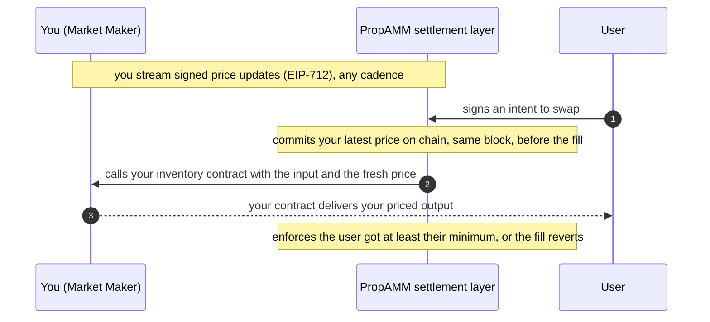

# PropAMM Architecture

PropAMM is a settlement layer for market makers. You stream prices. We settle the trades against your inventory, on chain, with the protections and the gas handled for you. You keep full control of pricing.

This is the high-level picture. For exactly what you implement, see the [integration guide](./integration.md).

## What we operate

The settlement layer has two parts:

- **An off-chain orchestrator node.** It takes your streamed price updates and users' signed intents, commits your prices on chain, and drives settlement. You never run it or think about it.
- **Trustless on-chain settlement contracts.** They settle each user intent using ERC-8211, with the guards and protections enforced in the contract: the user receives at least what they signed for or the trade reverts, and your inventory only ever moves on your own terms.

You connect to the orchestrator and stream prices. That is the whole of your footprint.

## What you control, what we handle

You control pricing, and only pricing:

- Stream EIP-712 signed price updates, at any cadence, for the pairs you support.
- Decide the output your inventory contract delivers, on chain, with whatever pricing logic you want.

We handle everything else:

- Committing your price updates on chain, efficiently.
- Matching them with users' signed intents.
- Landing the transactions reliably and paying the gas. The flow is gasless for you.
- Ordering at the transaction level: your price update is committed before the order settles against it.

You never send a transaction, hold gas, or deal with chain infrastructure.

## Same-block price freshness

The settlement contract enforces, on every fill, that the price it settles against was committed on chain in the same block. We always commit your latest price first, in that same block, before any intent settles against it. A price older than the current block cannot be used.

This is what closes the toxic-flow gap. When volatility hits, latency bots try to trade against a stale on-chain price before the market maker refreshes it, pocketing the difference. Because your fresh price is committed in the same block as the fill and the contract rejects anything older, that stale-price window is gone. You can quote tight without being picked off.

The rule lives in the contract and is checked by every node on the normal settle path. There is no dependency on a particular block builder or any off-chain ordering service.

## The flow

## What you get

| | |
|---|---|
| Gasless | You never send a transaction or hold gas. We land everything and pay for it. |
| You own pricing | You set the output your inventory delivers, on chain, with any logic you want. |
| Protected from stale-price pickoff | Fills settle only against a price committed in the same block. Old prices cannot be used. |
| Plug and play | You stream signed prices and run a small inventory contract. Nothing else. |
| In control | Only your approved executor can move your inventory, and only on your terms. |

Your signing key is the only sensitive surface on your side. Everything else is enforced by the contracts or handled by us.

## Reference

- MM integration: [integration.md](./integration.md)
- ERC-8211 standard: <https://erc8211.com/>
