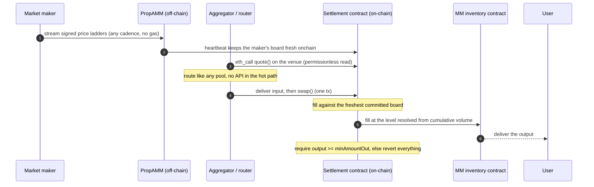

# Biconomy PropAMM Architecture

The market maker brings pricing and inventory; Biconomy PropAMM is the rest of the machinery a proprietary AMM needs on chain: the settlement contract, price commit and freshness enforcement, transaction management, and the protections for both sides.

## What Biconomy PropAMM handles

For every fill, it does the work that would otherwise fall on the market maker:

- **Price commit and versioning.** It commits the market maker's freshest signed price ladder on chain, inside the transaction that settles the order, and every fill settles against the freshest committed, unexpired version. A fresher committed ladder cancels the one before it. The settlement contracts resolve which price level applies from the volume already filled against that signed version, so the level is never chosen by the operator, and total volume against a signed ladder can never exceed the depth the market maker signed for it, once, across its whole life.
- **No gas for the market maker.** Quoting costs nothing on chain: a ladder is signed off chain and only appears in calldata when a fill actually happens. The party routing the flow submits the transaction and pays its own gas. The market maker sends nothing on chain.
- **No custody, no standing approvals.** The settlement contract holds nothing between transactions and never holds a standing approval. Input arrives for the duration of one call and leaves in the same call.
- **Freshness enforcement.** Every price carries a maker-signed expiry, and every fill is checked against it: an expired price cannot settle through any path, and a superseded price cannot settle while its replacement lives. Freshness is priced per quote by the market maker, from seconds-long ticks to longer aggregator quotes.
- **Delivery floor.** The receiver must gain at least `minAmountOut` of the output token, measured on their own balance, or the whole settlement reverts. Enforced by the contract.
- **Composition.** A single settlement can split across several market makers, chain hops through a pivot token, and mix maker liquidity with external venues, all in one all-or-nothing transaction. The market maker's inventory contract sees only its own simple fill.

## The market maker's side

Two things, both owned by the market maker:

- **A price stream.** EIP-712 signed price ladders (standard levels: cumulative size caps, a price per depth tranche), at any cadence, for the pairs they support. A one-level ladder is a flat price.
- **An inventory contract.** Holds the output token and decides the delivered amount from the committed price, with whatever pricing logic the market maker uses. Its inventory only moves through its own approved executor.

Pricing, inventory, and counterparty policy stay entirely with the market maker. Biconomy PropAMM never sets a price, never holds funds at rest, and the inventory contract can decline any fill. Everything between a price update and a settled trade is Biconomy PropAMM's job.

## A fill, step by step

## Price freshness and versioning

Every signed ladder carries two maker-chosen values that the contract enforces on every fill:

- **An expiry.** The ladder settles fills only until its `expiresAt`. The market maker prices the window per quote: a hosted stream signs seconds-long ticks, a quote handed to an aggregator pipeline signs a longer window with the option priced into the spread.
- **A version.** A fresher committed ladder cancels the one before it: the superseded ladder stops filling the moment its replacement is committed and live. A still-valid older quote can take over only after the newer one has expired, and never with fresh depth.

Depth is budgeted per signed version: a ladder can fill at most its top level in total, once, ever, however the flow is sliced, ordered, or spread across blocks. Re-streaming is therefore also the cancel mechanism, and a market maker who wants everything dead immediately commits a replacement whose validity covers the longest outstanding quote.

Two consequences do the work against toxic flow. First, a stale price cannot settle: the freshness bound is the expiry the market maker signed, and a superseded price is dead while its replacement lives, so latency bots cannot trade against a number the market maker has moved away from. Second, an in-flight trade that carries a superseded price does not revert: it settles at the market maker's freshest committed price instead, so re-streaming claws the option back rather than handing it to whoever holds the old quote. Adverse selection is not removed entirely, but the stale-price path is priced and bounded by the market maker, and none of it depends on a specific block builder or an off-chain ordering service.

## Reference

- MM integration: [integration.md](./integration.md)
- ERC-8211 standard: <https://erc8211.com/>

## How the same liquidity is consumed

One maker stream serves every execution lane simultaneously, under one signature and one
shared per-version depth budget. The TTLs a maker signs select its lanes: seconds-long quotes
serve the hosted flow and the onchain boards; longer-lived quotes additionally serve
RFQ-style pipelines, with that window priced by the maker who chose to sign it.

| Lane | Consumer | Shape |
|---|---|---|
| Onchain | aggregators and routers integrating prop AMMs as pools | deterministic `quote`/`swap` on the venue or per-maker pools, boards kept fresh onchain, permissionless reads and fills |
| Hosted | retail and intent flow through the hosted settlement | signed intents, gasless via Permit2, submitted by the network within seconds of pricing |
| Firm quote | RFQ-style routers fetching calldata per trade | `calls[]` executed as-is; settles at the maker's freshest committed price, never below the quoted floor |
| Scaled firm quote | routers that rescale a leg's input at execution time | one calldata, `amountIn` rewritable at byte offset 68, either direction |

Details for the aggregator lanes live in [aggregator-api.md](aggregator-api.md); the maker
sees all of them as the same stream (sizing guidance in [integration.md](integration.md)).

