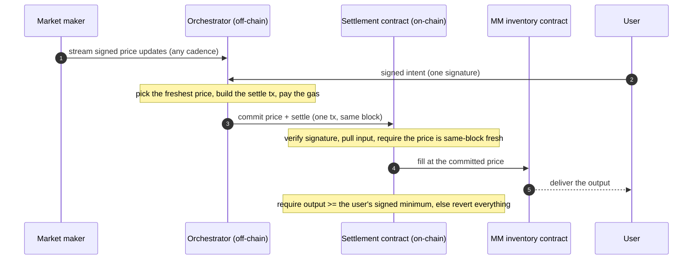

# Biconomy PropAMM Architecture

Biconomy PropAMM is the infrastructure for running a proprietary AMM on chain. A proprietary AMM is an AMM run by a market maker: the market maker brings the pricing and inventory. Biconomy PropAMM does everything else needed to run it on chain. It keeps the price fresh, lands the transactions, and enforces the protections for both sides.

Running one on chain otherwise means building and operating the settlement contract, the same-block price-commit machinery, gas and transaction management, and the reliability around all of it. Biconomy PropAMM is that machinery, so a market maker only has to price.

## What Biconomy PropAMM handles

For every user intent, it does the work that would otherwise fall on the market maker:

- **Price commit and ordering.** It commits the market maker's freshest signed price on chain and settles the order against it in the same block, with the price committed before the fill.
- **Transaction submission and gas.** It builds and submits the settlement transaction and pays the gas. The market maker sends nothing on chain.
- **Reliable landing.** Submission is managed with nonce handling and retries, so a transient RPC or inclusion failure is retried rather than the order being dropped.
- **Signature and funds.** The contract verifies the user's signature and pulls their input under the approval method the user chose, holding no standing approvals at rest.
- **Freshness enforcement.** Every fill is checked against the same-block price rule. A price older than the current block cannot settle.
- **Delivery floor.** The user must receive at least the minimum they signed for, or the whole settlement reverts.
- **Isolation.** Intents settle independently. A failing fill reverts on its own and does not affect the others.
- **Native assets.** ETH is wrapped and unwrapped at the boundary, so the market maker's inventory contract only ever deals in ERC-20s.

## The market maker's side

Two things, both owned by the market maker:

- **A price stream.** EIP-712 signed price updates, at any cadence, for the pairs they support.
- **An inventory contract.** Holds the output token and decides the delivered amount from the committed price, with whatever pricing logic the market maker uses. Its inventory only moves through its own approved executor.

Pricing, inventory, and counterparty policy stay entirely with the market maker. Biconomy PropAMM never sets a price, never holds funds at rest, and the inventory contract can decline any fill. Everything between a price update and a settled trade is Biconomy PropAMM's job.

## A fill, step by step

## Same-block price freshness

The settlement contract enforces, on every fill, that the price it settles against was committed on chain in the same block. The orchestrator commits the latest price first, in that block, before the order settles against it. A price older than the current block is not accepted.

This is the mechanism against toxic flow. When the market moves, latency bots try to trade against an on-chain price that has gone stale before the market maker refreshes it. Committing a fresh price in the same block as the fill, and rejecting anything older, narrows that window as far as the underlying chain allows. It does not remove adverse selection entirely, but it closes the cross-block stale-price path, and it does not depend on a specific block builder or an off-chain ordering service.

## Reference

- MM integration: [integration.md](./integration.md)
- ERC-8211 standard: <https://erc8211.com/>
