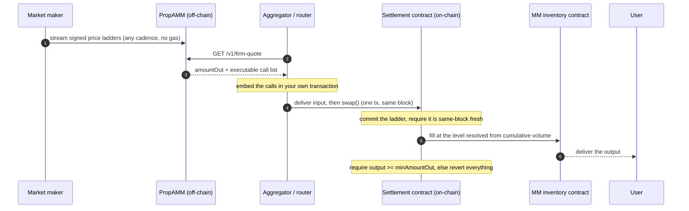

# Biconomy PropAMM Architecture

Biconomy PropAMM is the infrastructure for running a proprietary AMM on chain. A proprietary AMM is an AMM run by a market maker: the market maker brings the pricing and inventory. Biconomy PropAMM does everything else needed to run it on chain. It keeps the price fresh, lands the transactions, and enforces the protections for both sides.

Running one on chain otherwise means building and operating the settlement contract, the same-block price-commit machinery, gas and transaction management, and the reliability around all of it. Biconomy PropAMM is that machinery, so a market maker only has to price.

## What Biconomy PropAMM handles

For every fill, it does the work that would otherwise fall on the market maker:

- **Price commit and ordering.** It commits the market maker's freshest signed price ladder on chain and settles the order against it in the same block, with the ladder committed before the fill. The settlement contracts resolve which price level applies from cumulative filled volume, so the level is never chosen by the operator, and total volume against a ladder in a block can never exceed the depth the market maker signed.
- **No gas for the market maker.** Quoting costs nothing on chain: a ladder is signed off chain and only appears in calldata when a fill actually happens. The party routing the flow submits the transaction and pays its own gas. The market maker sends nothing on chain, ever.
- **No custody, no standing approvals.** The settlement contract holds nothing between transactions and never holds a standing approval. Input arrives for the duration of one call and leaves in the same call.
- **Freshness enforcement.** Every fill is checked against the same-block price rule. A price older than the current block cannot settle.
- **Delivery floor.** The receiver must gain at least `minAmountOut` of the output token, measured on their own balance, or the whole settlement reverts. Enforced by the contract, not by policy.
- **Composition.** A single settlement can split across several market makers, chain hops through a pivot token, and mix maker liquidity with external venues, all in one all-or-nothing transaction. The market maker's inventory contract sees only its own simple fill.

## The market maker's side

Two things, both owned by the market maker:

- **A price stream.** EIP-712 signed price ladders (standard levels: cumulative size caps, a price per depth tranche), at any cadence, for the pairs they support. A one-level ladder is a flat price.
- **An inventory contract.** Holds the output token and decides the delivered amount from the committed price, with whatever pricing logic the market maker uses. Its inventory only moves through its own approved executor.

Pricing, inventory, and counterparty policy stay entirely with the market maker. Biconomy PropAMM never sets a price, never holds funds at rest, and the inventory contract can decline any fill. Everything between a price update and a settled trade is Biconomy PropAMM's job.

## A fill, step by step

## Same-block price freshness

The settlement contract enforces, on every fill, that the price ladder it settles against was committed on chain in the same block. The freshest ladder is committed first, in that block, before the order settles against it. A ladder older than the current block is not accepted, and the freshness rule now covers the whole size dimension of the price: every level a fill can touch was signed for this block.

This is the mechanism against toxic flow. When the market moves, latency bots try to trade against an on-chain price that has gone stale before the market maker refreshes it. Committing a fresh price in the same block as the fill, and rejecting anything older, narrows that window as far as the underlying chain allows. It does not remove adverse selection entirely, but it closes the cross-block stale-price path, and it does not depend on a specific block builder or an off-chain ordering service.

## Reference

- MM integration: [integration.md](./integration.md)
- ERC-8211 standard: <https://erc8211.com/>
