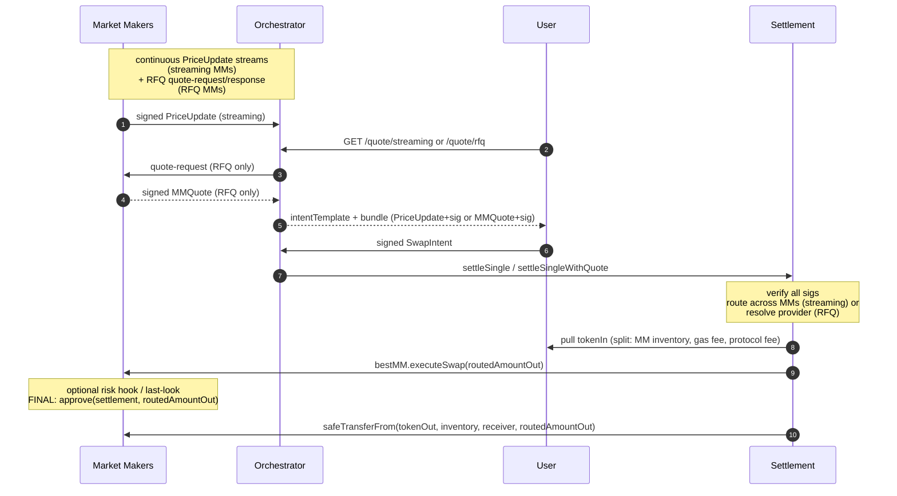

# propAMM Architecture Overview

A coordinated settlement layer for proprietary market makers on EVM L2s. Market makers publish signed prices through an off-chain orchestrator and settle on-chain through a shared settlement contract. Each market maker keeps proprietary pricing, inventory, and counterparty logic in its own contract. The shared layer handles intent routing, signature enforcement, fund movement, and atomic execution.

The v1 settlement contract supports two channels on one substrate:

- **Streaming + multi-MM routing**: multiple market makers co-exist on the same settlement contract; the contract polls each registered MM's `previewSwap` and picks the best `amountOut` per order automatically.
- **Pin-RFQ**: market makers sign firm per-order `MMQuote`s off-chain; settlement validates the signature, enforces a cryptographic fee binding, and pulls exactly the signed amount from the MM's inventory.

Users sign one intent regardless of channel. The same provider contract serves both channels. Native ETH input/output is handled via a sentinel address at the settlement boundary.

This document describes the conceptual model, the on-chain and off-chain components, the trust boundaries, and the benefits the protocol delivers to market makers. It does not cover implementation specifics — only what an integrator needs to reason about the system.

## The layered model

The design separates concerns into two layers, with a clean interface between them.

### Layer 1 — Shared settlement substrate

A single deployed contract per chain, identical for every market maker. Its job:

- Verify the user's signed `SwapIntent` and every market maker's signed `PriceUpdate` (streaming) or `MMQuote` (RFQ). EOA, EIP-1271, and EIP-6492 (counterfactual smart wallets) all work transparently.
- Pull the user's `tokenIn` using whichever approval mode they signed: standard ERC-20 approve, ERC-2612 permit, Permit2 witness-bound (witness = intent hash), or EIP-3009 receive-with-authorization. All four are exact-amount per-intent.
- Wrap and unwrap native ETH at the boundary when the intent uses the native sentinel for `tokenIn` or `tokenOut`. Market makers see WETH only.
- Track the latest signed price per `(market maker, tokenIn, tokenOut)` direction. Each direction is its own storage slot and nonce stream — the contract does not infer inverse pair prices.
- **Streaming**: route each intent to the best MM by polling `previewSwap` across all registered providers that support the pair direction, then hand off to the winning provider for the actual fill.
- **RFQ**: validate the MM's signed `MMQuote`, resolve `quote.mm` to its registered `IMMProvider`, enforce the cryptographic fee binding `netAmountIn == quote.amountIn`, hand off to the provider with the signed `amountOut`.
- **Pull model on `tokenOut`**: settlement is the sole authority over how much `tokenOut` leaves MM inventory. The provider's `executeSwap` grants an exact, per-fill `routedAmountOut` allowance; settlement immediately `transferFrom`s exactly that amount. No standing allowance from MM inventory to settlement.
- Enforce single-use user intents (per-trader bitmap), monotonic market-maker nonces (per direction on streaming, per MM on RFQ), deadlines, and an optional exclusivity window.
- Isolate failures per intent — one bad fill emits an event with a 4-byte error selector and the rest of the batch continues. User nonces are not consumed on `_settleOne` / `_settleOneRfq` failures.

This layer is open and verifiable. Every market maker uses the same one; users sign against the same domain regardless of who fills them.

### Layer 2 — Market-maker provider contract

A contract each market maker deploys themselves. It implements a small interface the settlement contract calls into during every routing decision and every fill. Inside this contract the market maker is free to do anything:

- Apply curve-based price padding or spread.
- Filter counterparties by whitelist, blacklist, or any custom predicate.
- Maintain freshness checks against the anchor price using their own logic (in addition to the settlement contract's same-block enforcement).
- Manage inventory across pairs.
- Apply per-pair fill caps or risk limits.
- Decline an order — return 0 from `previewSwap` (streaming), simply don't respond on the RFQ WebSocket, or revert in `executeSwap` for last-look on either channel.

The settlement contract has no knowledge of, and no opinion on, what the provider does inside. The provider's only mandatory behaviour inside `executeSwap` is to grant settlement an exact `routedAmountOut` allowance on `tokenOut` before returning. Anything else (state updates, risk checks, last-look revert) is optional and proprietary.

```solidity
// Canonical executeSwap body
function executeSwap(SwapParams calldata params) external {
    require(msg.sender == params.settlement, "OnlySettlement");
    // [optional risk hook / last-look revert]
    IERC20(params.tokenOut).approve(params.settlement, params.routedAmountOut);
}
```

## Two channels on one substrate

### Streaming — anchor-based per-order routing

MMs publish signed `PriceUpdate` payloads continuously over WebSocket. The orchestrator absorbs the freshest signature and commits it on-chain (either standalone or atomically with a settle call). The settlement contract maintains an owner-curated registry (capped at 32 entries) of registered MM provider contracts. For every user intent on the streaming path, settlement iterates the registry, calls each provider's `supportsPair` to filter, polls `previewSwap` on the survivors, and routes the order to the MM offering the highest `amountOut`. Routing happens in the same transaction as the fill — there is no off-chain auction or pre-trade negotiation.

Key properties:

- **Users don't pin an MM.** The signed intent specifies the pair and constraints; the contract picks the filling MM.
- **MMs compete on price.** A provider that returns a higher `previewSwap` for a given `(tokenIn, tokenOut, netAmountIn, anchorPrice)` wins the order. Returning 0 declines cleanly.
- **Anchor namespace is per-MM, per-direction.** Each market maker's stored prices for `(WETH → USDC)` are isolated from every other MM's commits on that direction and from their own commits on `(USDC → WETH)`.
- **Lazy commit.** Only the price updates actually consumed by the routing decisions in a batch get written to storage. Redundant or stale commits no-op cheaply.
- **Per-intent failure isolation.** Each intent runs inside a self-call wrapped in try/catch. A failure emits `IntentFailed(intentHash, errorSelector, reason)` with a 4-byte selector that downstream watchers use to decide retry-vs-drop.

### Pin-RFQ — firm signed quotes

For pairs and sizes where streaming is impractical (long-tail tokens, large fills, last-look-style flow, MMs with existing RFQ infrastructure), MMs sign a per-order `MMQuote` and settlement consumes it directly:

```
MMQuote(
  address mm,            // signer; settlement resolves to provider via providerForSigner
  address trader,        // commits the quote to a specific user
  address tokenIn,       // logical (WETH for native pairs); not the sentinel
  address tokenOut,      // logical
  uint256 amountIn,      // NET — what reaches MM inventory after fees
  uint256 amountOut,     // FIRM commitment; settlement pulls exactly this
  uint256 expiresAt,     // unix ms; wall-time validity
  uint256 nonce          // per-MM monotonic, separate stream from PriceUpdate
)
```

The orchestrator solicits the quote, returns `{intent, mmQuote, quoteSig}` to the user, the user signs the intent, and either the orchestrator or the user calls `settleSingleWithQuote(bundle, quote, quoteSig)`. Settlement validates the quote signature, resolves `quote.mm` to its registered provider, enforces the cryptographic fee binding `netAmountIn == quote.amountIn`, pulls `tokenIn` split, calls `executeSwap` with `routedAmountOut = quote.amountOut`, and pulls exactly that amount from the MM's inventory.

The RFQ path does not touch the streaming anchor storage. The streaming path does not touch the RFQ nonce stream. They share infrastructure but no on-chain state.

### Cryptographic fee binding (RFQ)

`MMQuote.amountIn` is the net amount — `grossAmountIn − feeAmount − protocolFee`. Settlement recomputes the same net at settle time and enforces equality:

```solidity
require(netAmountIn == quote.amountIn, QuoteNetAmountInMismatch);
```

This single check delivers three protections without any extra plumbing:

- If the owner moves `protocolFeeBps` between sign and settle, every in-flight quote is auto-invalidated.
- A quote signed for orchestrator-relay (where `feeAmount > 0` is baked into the net) cannot be replayed under self-relay (`feeAmount = 0`). The net amounts differ; the equality fails.
- The MM only ever signs against "for N net tokenIn into my inventory, I commit M tokenOut". Fee policy is settlement's concern, not the MM's pricing concern.

## How a fill happens

A user signs one swap intent: what they want to trade, the floor they will accept, the deadline, and the channel they're using (signalled implicitly by `feeAmount` and the entry point the orchestrator or wallet calls).



The market makers publish signed prices (streaming) or respond to RFQ requests (RFQ). The orchestrator pairs an intent with the right bundle and submits the settlement transaction. The contract runs verification, routes (streaming) or resolves the provider (RFQ), pulls `tokenIn` from the user (split between MM inventory, the gas-fee recipient, and any protocol fee), and calls the winning provider's `executeSwap`. The provider grants an exact-amount allowance back to settlement, which immediately consumes it via `safeTransferFrom`. Multiple intents that arrive close together can settle in one batched transaction, each routed independently.

If any step fails for a single intent, the chain unwinds that intent only (an `IntentFailed` event is emitted with a 4-byte error selector); the rest of the batch continues. The user's nonce remains free for retry.

## Native ETH handling

The settlement contract uses a single sentinel address (`0xEeeeeE…`) for both native input and native output. The sentinel appears only in `SwapIntent.tokenIn` / `SwapIntent.tokenOut`. It never appears in `MMQuote.tokenIn` / `tokenOut`, in `PriceUpdate.tokenIn` / `tokenOut`, in `SwapParams`, or in storage keys — those all use the logical token (WETH for native pairs).

- **Native input**: the user calls a settle entry point with `msg.value == intent.amountIn`. Settlement enforces `msg.sender == intent.trader` (self-relay only — the orchestrator does not custody user ETH), deposits to WETH, and then `safeTransfer`s WETH to MM inventory + the fee recipients. Settlement returns to zero WETH balance at end of intent.
- **Native output**: settlement resolves the receiver to itself, pulls WETH from MM inventory via `safeTransferFrom`, calls `WETH.withdraw`, and forwards ETH to the user's receiver via `call{value:}`. Native output works in both relay modes — the orchestrator can carry an ERC-20 → native intent.

The MM provider sees only WETH in `SwapParams`. No special handling needed on the MM side.

## Settlement modes (orchestrator-relay vs self-relay)

The intent's `feeAmount` field controls who pays settlement gas:

- **`feeAmount > 0`** — orchestrator-relay. The orchestrator submits the settle transaction and recovers gas from the user's input token; the user signs one message and never holds ETH.
- **`feeAmount = 0`** — self-relay. The user (or aggregator) submits the settle transaction themselves and pays gas in ETH.

The `executor` and `exclusivityDeadline` fields let the signer grant a specific submitter first-look during a chosen window, for flows that need it. Native input requires self-relay structurally.

---

## Benefits for market makers

Working with Biconomy to integrate with propAMM delivers the following benefits to every market maker, regardless of strategy or operational model:

1. **On-chain protections** — atomic, signature-enforced settlement with same-block freshness (streaming) and cryptographic fee binding (RFQ) on every fill.
2. **Minimised trust model** — trust concentrates on your signing key; every other component is either signature-enforced, reentrancy-bounded, or non-privileged. Pull model on `tokenOut` removes the prior trust assumption that the MM-returned `amountOut` was honest — settlement is the sole authority over the pull amount.
3. **Operations and cost predictability** — a hardened, load-validated orchestrator with lossless retry, parallel-safe execution, and well-understood per-fill costs.
4. **Security** — settlement contract with a deliberately minimal owner control surface and standard defensive patterns throughout.
5. **Off-chain participation** — market makers publish signed `PriceUpdate`s (streaming) and/or signed `MMQuote`s (RFQ) over WebSocket. Same signing identity for both channels.
6. **Quoting competitively** — fast price updates plus per-block freshness enforcement reduce adverse selection, letting you quote tighter spreads with confidence.

---

### On-chain protections

Three classes of checks fire on every fill, atomically inside the same transaction.

**Atomicity.** User funds never move without the protocol delivering at least the user's `minAmountOut`. If the provider reverts for any reason, the per-intent try/catch unwinds that fill; the user's funds are returned in the same EVM revert. The settlement contract acts as a pure proxy on the fund-flow side (with one transient exception on the native-output unwrap path — documented).

**Signature enforcement.** Every market-maker-side payload — streaming `PriceUpdate` or per-request `MMQuote` — is EIP-712 verified against the signing key before any on-chain state changes. Forgery is impossible at the protocol layer. Signature verification works transparently across EOAs, EIP-1271 smart wallets, and EIP-6492 counterfactual wallets.

**Freshness.** Two paths to a fresh price:

- **Streaming**: the settlement contract enforces, on every fill, that the on-chain anchor was committed in the same block as the swap. There is no user-tunable staleness tolerance; the contract requires `block.number == anchor.commitBlock` and reverts otherwise. The MM-signed `expiresAt` adds a wall-time cap on top. Either the settle transaction itself commits a fresh MM-signed `PriceUpdate`, or another settlement in the same block has already committed the freshest signature and this transaction settles against that anchor.
- **RFQ**: `quote.expiresAt` (unix ms) is the wall-time gate. No same-block constraint; the MM's signature is the freshness signal.

This eliminates the largest class of toxic flow, which uses signatures from prior blocks. On the streaming side, intra-block staleness — drift between consecutive MM signatures within the same block (~200 to 500 ms at 5 to 10 Hz publishing cadence) — remains and is bounded by the MM's inter-signature interval. Closing this last gap requires within-block ordering control at the sequencer layer.

**Replay protection.** Every signed payload carries a nonce.

- User intents are single-use (per-trader bitmap).
- `PriceUpdate` nonces are strictly monotonic per `(mm, tokenIn, tokenOut)` direction. Same-nonce-different-content always reverts; same-nonce-same-content is an idempotent no-op (parallel-worker safe).
- `MMQuote` nonces are strictly monotonic per `mm` (independent stream from streaming nonces).

**Exclusivity.** Users can optionally pin a specific executor for a chosen window — useful for granting first-look to a trusted operator. The check is `tx.origin`-independent, so contract-account batching and account-abstraction flows work correctly.

**Pull model on `tokenOut` (both channels).** The MM provider's `executeSwap` is `void`. Settlement chooses `routedAmountOut` itself (streaming: `previewSwap` result; RFQ: `quote.amountOut`) and the provider grants an exact allowance on `tokenOut` from `inventory()` to settlement as the final step inside `executeSwap`. Settlement immediately `safeTransferFrom`s exactly that amount; the allowance returns to 0 in the same call frame. The MM has only one degree of freedom: revert in `executeSwap` (last-look) to refuse a fill. It cannot under-deliver, over-deliver, or send to the wrong receiver.

---

### Minimised trust model

| Party | Worst case if compromised | What they cannot do |
|---|---|---|
| **User** | Spam-submit intents (rate-limited at intake) | Harm other users or market makers |
| **Market maker** | Refuse to fill; sign stale streaming prices (caught by signed expiry + same-block) or stale RFQ quotes (caught by `expiresAt`) | Drain user funds — settlement enforces `minAmountOut` atomically inside reentrancy guard; over- or under-deliver `amountOut` (settlement controls the pull amount); reuse another MM's signature (per-MM namespaced anchor + per-MM RFQ nonce stream); rebind a `MMQuote` to a different `(trader, tokens, netAmountIn)` |
| **Market-maker provider contract** | Revert any fill (last-look) | Reenter the settle path; manipulate another MM's anchor; act on a price/quote not signed by its MM; influence the pulled `amountOut` beyond granting the exact `routedAmountOut` allowance |
| **Orchestrator** | Censor specific intents; choose ordering between two valid matches | Forge user or market-maker signatures; drain funds; pick a winning MM the contract doesn't have whitelisted; alter `feeAmount` after the user signed |
| **Relayer transaction sender** | Waste its own gas | Drain user or market-maker funds (no token allowances to user funds; no standing allowance from MM inventory) |
| **Settlement contract owner** | Pause settlement; register/unregister MMs; set fee parameters; transfer ownership (two-step) | Upgrade the contract; withdraw user or market-maker funds (no such functions exist) |

The integration architecture deliberately concentrates trust in one place: the market maker's signing key. Every other component is either signature-enforced, reentrancy-bounded, or has no privileged authority over funds.

---

### Operations and cost predictability

**Operational hardening.** The protocol is designed to handle real-world failure modes without losing intents or compromising soundness.

- **Parallel-safe.** Multiple settlement workers can submit transactions concurrently against the same chain without producing race-induced reverts. Older-nonce price commits no-op safely on-chain.
- **Lossless retry on transient failure.** Every submitted transaction is tracked through to chain receipt. Failed intents emit `IntentFailed(intentHash, errorSelector, reason)`; the 4-byte selector tells the watcher whether to retry next block (transient) or drop (terminal) — no re-simulation required. Nonces are not consumed on `_settleOne` / `_settleOneRfq` failures, so the same signed intent can be re-submitted byte-for-byte.
- **Bounded retry on persistent failure.** A deterministically-reverting intent is dropped after a configurable retry budget, with operator metrics indicating which intent and why. Stops runaway gas spend on poison flow.
- **Batched settlement with per-intent isolation.** Multiple intents settle in one transaction with independent try-catch boundaries per intent. One bad fill doesn't block the rest of the batch.
- **Multi-RPC failover.** Primary RPC errors fall over to secondary endpoints automatically; persistent errors propagate to the operator.

**Measured throughput (preliminary).** One orchestrator instance, one `(market maker, pair)` slot, settles **310 intents per second** on a Base-class L2 in the orchestrator-mediated path users take, with **100% on-chain settlement** and **zero on-chain reverts**. Per settled intent at 5-intent batches: **~80,000 gas** on chain. At 310 intents/sec per slot, the slot uses about **16% of Base's per-second gas budget** at current parameters — plenty of room above this number, easy to scale up and fill more blockspace from here.

Streaming routing overhead: ~5k gas for `supportsPair` per registered MM + ~5–10k for `previewSwap` per MM that supports the pair. At 4 MMs per pair, per-order routing overhead is around 40k on top of the baseline. RFQ has no routing loop; per-intent gas anchored by the user sig check + quote sig check + tokenIn split + executeSwap hook + tokenOut pull — roughly ~95k for an ERC-20 → ERC-20 RFQ fill on Base.

**Predictable costs.** A settle transaction has two cost components measured from on-chain receipts in the load tests:

- **Fixed per batch** (paid once per transaction): commits the latest MM-signed `PriceUpdate`s as on-chain anchors (streaming only). About 50,000 gas and 150 bytes of calldata, totaling approximately **$0.0018** per committed MM at current Base mainnet gas (L1 base fee 0.4 gwei, ETH $2,000).
- **Per intent (variable)** (paid for each intent in the batch): verify the user's signature, run freshness gates, route (streaming) or resolve provider (RFQ), pull funds, call the winning provider, pull `tokenOut`, emit event. About 70,000 gas and 760 bytes of calldata, totaling approximately **$0.0074** per intent at current conditions.

A transaction with N intents costs `$0.0018 × M committed MMs + N × $0.0074`. At the load-test batch density of 5 intents per transaction, that works out to about **$0.008 per intent** average. Under sustained load batches grow naturally (10 to 20 intents); per-intent cost approaches the variable floor of $0.0074. The price-update share of per-intent cost is about $0.00036 at N=5 (5% of total) and drops below 2% at N=20.

The orchestrator pays this gas in ETH from a relayer pool and recovers it from the user's `feeAmount` in the input token. Per-intent cost scales linearly with L1 gas conditions; at typical Ethereum activity levels (5 gwei L1), per-intent cost is about $0.097 in a 5-intent batch.

---

### Security

The settlement contract is designed with a minimal control surface and standard defensive patterns throughout:

- **Reentrancy guards** on every state-mutating entry point. **Solady SafeTransferLib** for all token movement. **Pause kill-switch** for operator-side incident response.
- **Two-step ownership transfer** prevents accidental control loss.
- **No upgrade path. No withdrawal path.** The settlement contract cannot drain user or MM funds under any owner action. The owner can pause, register/unregister MMs, set fee parameters, and transfer ownership; nothing else.
- **EIP-712 + EIP-1271 + EIP-6492** for signature verification — works with EOA wallets, smart-account wallets (deployed or counterfactual), and HSM-backed signing infrastructure with no protocol-level distinction.
- **Pure proxy** — settlement never holds tokens at rest, with one transient exception on the native-output unwrap path (settlement holds WETH for the span of three opcodes between `safeTransferFrom`, `WETH.withdraw`, and forwarding ETH). On the ERC-20-output path, `tokenIn` flows user → MM inventory + fee recipients in independent `transferFrom`s; `tokenOut` is pulled directly from MM inventory to the receiver — no intermediate hop through settlement.

---

### Off-chain participation

Market makers publish signed price updates and/or respond to signed RFQ requests over a WebSocket connection. Payloads are signed off chain and consumed by the settlement contract at fill time. One signing identity (the MM's `mmAddress`) covers both channels; subscribe to whichever you want to serve.

The market maker's infrastructure footprint is a WebSocket connection and a signing process. EIP-712 plus EIP-1271 / EIP-6492 mean the signing path works the same for EOA wallets, smart-account wallets (deployed or counterfactual), and HSM-backed signing infrastructure.

---

### Quoting competitively

Market makers are protected from adverse selection by the protocol's design, which allows them to quote tighter, more competitive rates.

Two mechanisms drive this:

**Fast price updates with freshness enforcement (streaming).** The streaming channel is designed for high-cadence price publication — 5–50 Hz typical, higher supported. The contract requires every fill to settle against an anchor committed in the current block, which closes the prior-staleness vector that most permissionless L2 propAMMs leave open. Residual intra-block exposure (CEX drift between consecutive MM signatures within the same block) still requires some spread padding on volatile pairs, but the structural reduction from unbounded prior staleness to bounded intra-block residual is material.

**Selective counterparty and order control.** Through the provider contract, market makers retain full control over which traders they fill, at what sizes, with what padding. The defensive reference implementation supports whitelists, bps-based spread curves, and per-pair fill caps — all enforced atomically on-chain, not just off-chain. A provider that doesn't want a particular order returns 0 from `previewSwap` and the router skips it cleanly. On RFQ, declining is implicit — don't sign a quote. A provider that wants last-look can revert in `executeSwap` on either channel; settlement treats the revert as a per-intent failure, the next intent in the batch continues, and the user's nonce stays free.


---

## Boundaries — what the protocol does not do

- **Does not price your inventory.** The market-maker provider contract determines `routedAmountOut` via `previewSwap` (streaming) or by signing `MMQuote.amountOut` (RFQ); settlement's only check is that the pulled amount satisfies the user's `minAmountOut`.
- **Does not filter counterparties.** Whitelisting, blacklisting, KYC gates, or any other counterparty policy lives inside the market-maker provider contract.
- **Does not bound fill sizes.** The market maker enforces per-pair caps in its own contract.
- **Does not hedge.** Inventory management and external hedging are the market maker's responsibility.
- **Does not pin a specific MM per intent.** The user signs an intent; streaming routes per-order across registered MMs based on `previewSwap`; RFQ resolves the MM via the signed `quote.mm`.
- **Does not infer inverse pair pricing.** Each direction is a separate `(mm, tokenIn, tokenOut)` triple with independent storage and nonce streams. MMs commit each direction they serve.

## Standards and references

- **EIP-712** typed-data signatures for every signed payload (`SwapIntent`, `PriceUpdate`, `MMQuote`). Single domain (`name="PropAMMSettlement", version="1"`); chain replay is closed at the domain-separator level.
- **EIP-1271 / EIP-6492** signature verification supported transparently — smart-account wallets (deployed or counterfactual) and contract-backed market-maker signing keys work with no protocol-level distinction from EOAs.
- **Permit2** supported as one of four approval modes available to users (the others being standard ERC-20 approve, ERC-2612 permit, and EIP-3009 receive-with-authorization). Permits are bound to the specific intent via the canonical witness pattern.
- **EIP-3009** `receiveWithAuthorization` supported for USDC-style tokens; per-intent nonce derivation collides with the token-level nonce on replay.
- **ERC-8211-style** anchor-freshness predicates enforced at the settlement contract level on the streaming path: every fill requires `block.number == anchor.commitBlock` and reverts otherwise.

## Summary

The protocol is a thin shared substrate for atomic, signature-verified, per-order multi-MM-routed settlement (streaming) plus firm signed-quote settlement (RFQ) plus a per-market-maker proprietary layer for pricing and policy. Trust concentrates on the market-maker signing key; the pull model on `tokenOut` removes prior trust assumptions about MM-returned amounts. Operational hardening — race safety, lossless retry, bounded poison handling, multi-RPC failover — is in the substrate and the orchestrator, not the integrator's concern. Market makers bring pricing and inventory; the protocol handles everything around it.

Integration details — what to deploy, what to sign, and the wire format — are covered in the companion integration document.
