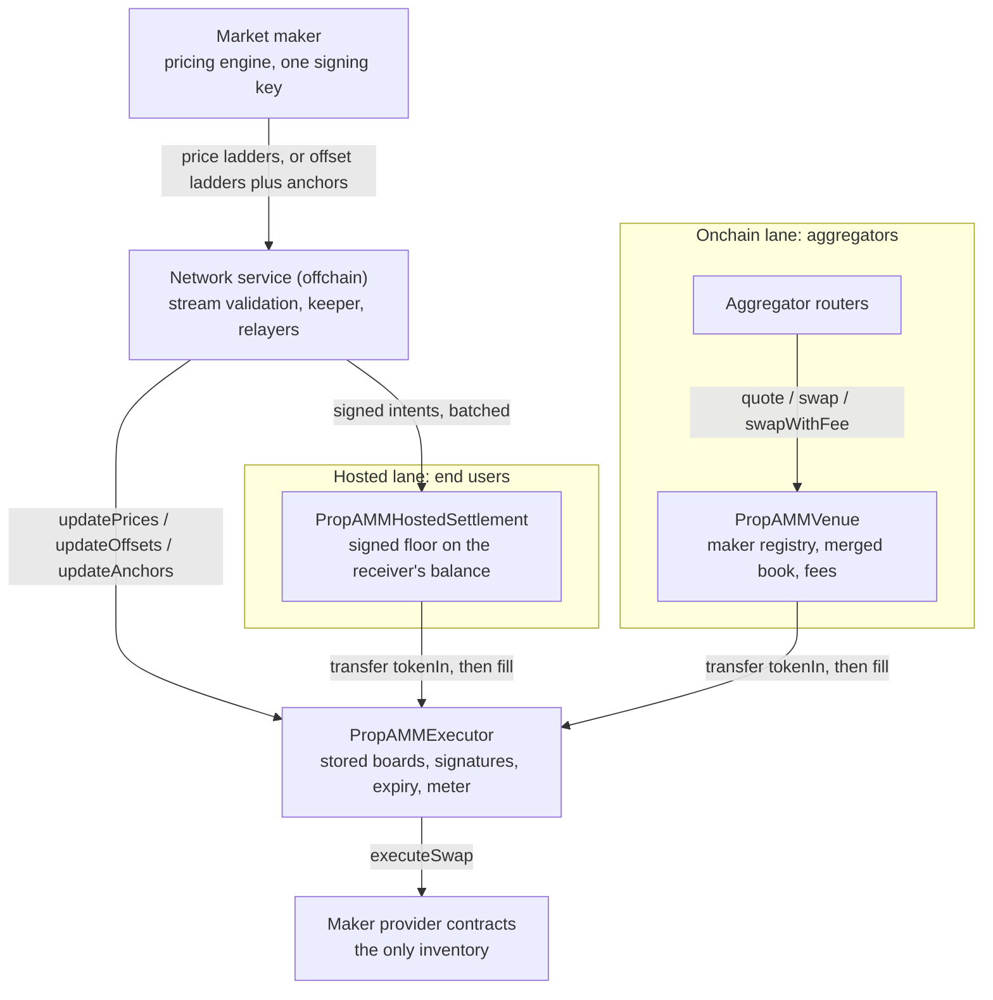
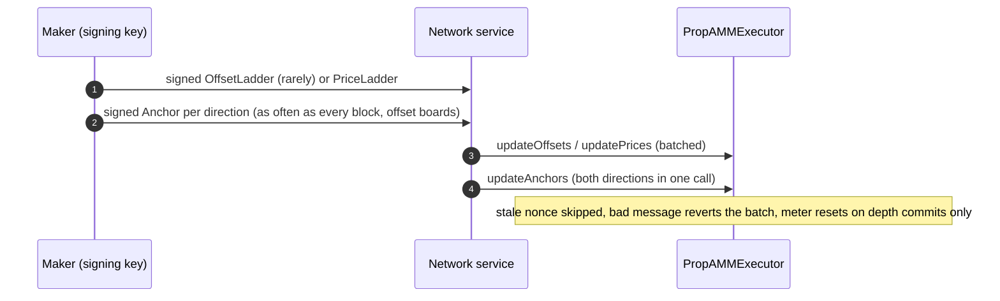
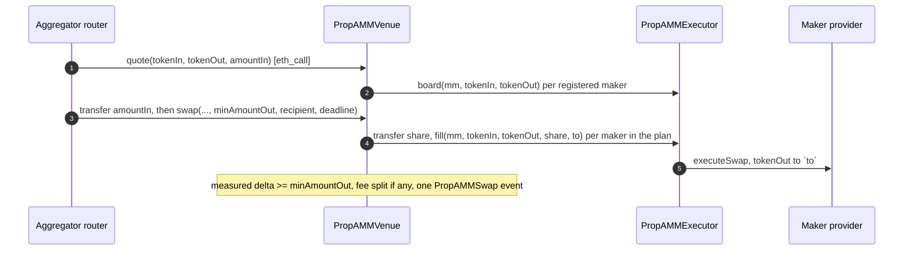

# Architecture

PropAMM lets market makers quote onchain from an offchain signed stream. A maker signs a board for each direction it quotes: either a price ladder (cumulative sizes with absolute prices) or an offset ladder (cumulative sizes with discounts below a reference price) plus anchors (the reference price itself, signed as often as every block). Anyone commits those messages to `PropAMMExecutor`, which stores the whole board and enforces it on every fill. Two lanes consume the boards: aggregator routers fill `PropAMMVenue` like any pool, and the network settles end users' signed intents through `PropAMMHostedSettlement`.

One guarantee for takers: the receiver's real balance grows by at least the floor, or the trade reverts. One guarantee for makers: inventory only ever fills at a price the maker signed, within the depth and expiry the maker signed.

## Two lanes over one executor



| Contract | Role | Holds funds between transactions |
|---|---|---|
| `PropAMMExecutor` | Stores one board per maker and direction, verifies commits, prices and meters every fill | No |
| `PropAMMVenue` | The onchain lane: registry of makers and pairs, merged book over their boards, push-payment swaps, fees | No |
| `PropAMMHostedSettlement` | The hosted lane: settles signed intents, one isolated frame per intent | No |
| `IMMProvider` implementations (`BasicMMProvider` or the maker's own) | The maker's inventory; releases output only to the executor | Yes, the maker's own |

| | Onchain lane | Hosted lane |
|---|---|---|
| Entry | `quote` / `swap` / `swapWithFee` on the venue | signed intents relayed by the network |
| Who submits | any router, permissionless | the network's relayers |
| Input arrives | pushed by the router to the venue before the call | pulled through Permit2 from the trader's signed intent |
| Floor | `minAmountOut` on the fee-net total delivered to `recipient` | the signed `minAmountOut` on the receiver's balance delta |
| Prices | every registered maker's board, read from the executor and merged best price first; `quote` equals delivery | the maker's board at execution; the intent's steps transfer input to the executor and call `fill` |

Both lanes end in the executor, the one contract a maker's inventory trusts. Its commit functions and its fill door are permissionless: every fill is checked against a maker-signed, committed, unexpired board within its once-spent meter, so any caller can only make a maker deliver exactly what the maker signed. Lanes are entrypoints, not systems: either runs without the other being deployed.

## PropAMMExecutor

### Boards

A board is one maker's depth schedule for one direction, keyed by `(mm, tokenIn, tokenOut)`. The reverse direction is a separate board with its own nonces, meter and anchor. A maker describes a board in one of two forms, both signed EIP-712 against the executor's domain (name `PropAMMExecutor`, version `2`, the chain id and the executor address) by an EOA or an EIP-1271 contract:

| Form | Message | Commit | Price of a level |
|---|---|---|---|
| Price ladder | `PriceLadder`: `Level[] levels`, each `(size, price)` | `updatePrices` | `price`, 1e18-scaled tokenOut per tokenIn |
| Offset ladder plus anchor | `OffsetLadder`: `Rung[] rungs`, each `(size, offsetPpm)`, plus `driftPpmPerSecond`; `Anchor`: `price`, `timestamp` | `updateOffsets`, `updateAnchors` | `anchor * (1e6 - offsetPpm - driftPpmPerSecond * age) / 1e6`, floored, where `age` is seconds since the anchor's `timestamp` |

`size` is cumulative: the total tokenIn volume available up to and including that level. Sizes strictly ascend from above zero, prices never improve with depth, offsets never decrease with depth and stay below one whole unit, and a board holds at most `MAX_LEVELS` (20) levels. The provider that fills the board rides inside the signed depth message, so a caller cannot redirect a fill to a different inventory.

Commits are batched (`ladders[]`, `sigs[]`) and permissionless. Inside a batch a message whose nonce is not fresher than the board's is skipped silently, before validation or signature checking; a fresher message that is malformed, expired or badly signed reverts the whole batch. The depth nonce is shared by price and offset ladders for the same board and must strictly increase; the anchor nonce is independent and must strictly increase too. A depth commit rebinds the provider, replaces every level, sets the mode and drift, and resets the meter. An anchor commit writes one storage word and leaves the meter alone. An anchor committed while the board is a price ladder is stored and unused until the maker commits an offset ladder.

A board is live when its depth version is inside its TTL and, for an offset board, its anchor is non-zero and inside its own TTL. `board()` reports the earlier of the two expiries as `expiresAt`. On an offset board, a rung whose total discount (offset plus drift) reaches one whole unit prices at zero, so the effective board ends before it; when the first rung is gone the board is dark (`BoardInactive`), not exhausted.

### The fill door

`fill(mm, tokenIn, tokenOut, amountIn, receiver)` is the only way inventory moves. The caller has already transferred `amountIn` of `tokenIn` to the executor. The executor:

1. rejects a zero `amountIn` and a board that is not live;
2. reads `provider.signer()` and requires it to equal `mm`, so a self-signed board cannot name someone else's provider and a rotated signer invalidates stale bindings;
3. sweeps the board from the meter: starting at `filled`, it consumes each level's remaining size at that level's current price, `out += floor(take * price / 1e18)`, and reverts `LadderDepthExhausted` if the order runs past the top size; a sweep whose output floors to zero reverts `ZeroPrice`;
4. advances `filled` by `amountIn`;
5. approves the provider for exactly `amountIn`, calls `executeSwap(tokenIn, tokenOut, amountIn, avgPrice, totalOut, receiver)`, and resets the approval to zero; any provider revert is wrapped into `FillLegFailed(provider, innerSelector, inner)`;
6. emits `MMFillExecuted`.

The meter is per depth version: it resets on every accepted depth commit, is untouched by anchor commits, and counts every fill from every caller and lane. A version's worst case is its top size, once. Consecutive fills pay successively deeper levels, so splitting an order never beats one fill.

Fills price at the board current at execution, never at calldata. A fill that lands after a maker update settles at the new board; the caller's floor is the protection against a worse one.

### Public surface

| Function | Access | Purpose |
|---|---|---|
| `DOMAIN_SEPARATOR()` | view | The EIP-712 domain makers sign against |
| `MAX_LEVELS`, `PPM` | constants | 20 levels; 1,000,000 parts per million |
| `updatePrices(PriceLadder[] ladders, bytes[] sigs)` | anyone | Commit price ladders |
| `updateOffsets(OffsetLadder[] ladders, bytes[] sigs)` | anyone | Commit offset ladders |
| `updateAnchors(Anchor[] anchors, bytes[] sigs)` | anyone | Commit anchors |
| `fill(address mm, address tokenIn, address tokenOut, uint256 amountIn, address receiver) returns (uint256 delivered)` | anyone, input pre-transferred | The fill door; returns what the provider reported |
| `board(address mm, address tokenIn, address tokenOut) returns (uint256[] sizes, uint256[] prices, uint256 filled, uint256 remaining, uint256 expiresAt, uint256 nonce, uint256 anchorNonce, uint8 mode)` | view | The live board as fills price it now; a dark board returns no levels and zero remaining |
| `quote(address mm, address tokenIn, address tokenOut, uint256 amountIn) returns (uint256 amountOut)` | view | What `fill` would deliver, or zero when dark or too large |
| `providerOf(address mm, address tokenIn, address tokenOut) returns (address)` | view | The provider bound at the last depth commit |
| `hashLadder(PriceLadder)`, `hashOffsetLadder(OffsetLadder)`, `hashAnchor(Anchor)` | pure | EIP-712 struct hashes |
| `ladderDigest(PriceLadder)`, `offsetLadderDigest(OffsetLadder)`, `anchorDigest(Anchor)` | view | Full digests, what a maker's key signs |

`mode` in `board()` is `0` for a board that has never been committed, `1` for a price ladder and `2` for an offset ladder.

Events: `LadderCommitted`, `OffsetsCommitted`, `AnchorCommitted` when a message is accepted, and `MMFillExecuted(mmProvider, mmSigner, receiver, tokenIn, tokenOut, amountIn, amountOut, avgPrice, filledAfter)` per fill, where `filledAfter` is the meter after the fill.

## Maker provider (`IMMProvider`)

The maker's inventory contract, either `BasicMMProvider` or the maker's own. Three functions: `signer()` (EOA or EIP-1271; checked on every fill against the board's `mm`), `previewSwap` (a view the network quotes hosted flow from; may apply the maker's own dynamics over the price it is handed, or return zero to decline) and `executeSwap` (gated on `approvedExecutor`; pulls `amountIn` from the executor and delivers `tokenOut` to the receiver, returning the amount). The executor hands the provider the exact swept total to deliver. Makers onboard by deploying a provider, funding it and streaming; the hosted lane needs no onchain registration. The venue owner registers the maker's signer for the onchain lane.

## PropAMMVenue (onchain lane)

One contract per chain, at the same address on every chain because its only constructor argument is the canonical executor:

- **Registry.** Owner-curated makers by signer address (`addMaker`, `removeMaker`, capped at `MAX_MAKERS`, 16) and advertised pairs (`addPair`, canonically ordered).
- **No price state.** The venue reads `PropAMMExecutor.board` for each registered maker on every quote and swap. What a router simulates is what the executor's fill door prices: same levels, same floor rounding, minus the maker's consumed meter.
- **Merged book.** `quote`, `levels` and `swap` run a k-way merge over the registered makers' live levels: at each step the maker whose next level prices best is taken, ties in registry order, until the order is covered or every board is spent. A level is consumed in one piece unless the order ends inside it, so each maker's per-level floors are exactly the ones its executor fill computes. An allocation whose floored output would be zero does not count as coverage.
- **Swaps.** `swap` and `swapWithFee` are push-payment: the router transfers `amountIn` to the venue and calls in the same transaction (`amountIn` at calldata byte offset 68). The venue recomputes the plan at execution, forwards each maker's share to the executor (`transfer` to the executor, then `fill`), measures the real balance delta of whoever the executor delivered to, and enforces `minAmountOut` on the fee-net total.
- **Fees.** An owner-set protocol fee (`feeBps`, capped at 100 bps, netted inside `quote`) and a router-supplied fee (`swapWithFee`, `extraFeePpm`, capped at 5%, paid straight to the router's `feeReceiver`). Neither touches what makers deliver.
- **Custody.** Nothing at rest. With both fees at zero the executor delivers straight to the recipient; when a fee applies the gross output lands at the venue and is split within the same transaction.

The full surface is in [aggregator-api.md](aggregator-api.md).

## Hosted lane

`PropAMMHostedSettlement` settles batches of end-user intents relayed by the network. A trader signs one EIP-712 message, an `Intent` carried as a Permit2 witness, naming `tokenIn`, `amountIn`, `tokenOut`, `minAmountOut`, `receiver`, a deadline and a nonce. Per intent, settlement snapshots the receiver's `tokenOut` balance, pulls `amountIn` through Permit2, runs the intent's steps, and requires the receiver's balance to have grown by at least `minAmountOut`. For a maker fill the steps are a `transfer` of `amountIn` to the executor followed by `executor.fill(mm, tokenIn, tokenOut, amountIn, receiver)`. No ladder travels in calldata; the fill prices at the maker's current board and the intent's floor catches a move against the trader.

Each intent runs in its own frame: a revert in one intent rolls back its own state, pull included, and the batch continues. A batch may commit fresh boards ahead of its fills (`updatePrices`, `updateOffsets` and `updateAnchors` are ordinary calls). Traders never approve settlement itself; they approve Permit2, and every signature binds the exact token, amount and intent.

## Data flow

### Maker stream and commit



### Onchain swap



### Hosted intent

```mermaid
sequenceDiagram
    autonumber
    participant U as Trader
    participant N as Network service
    participant S as PropAMMHostedSettlement
    participant E as PropAMMExecutor
    participant P as Maker provider

    U->>N: request a quote
    N-->>U: Intent to sign (one EIP-712 signature, Permit2 witness)
    U->>N: signed Intent
    N->>S: settle batch
    S->>E: commits, when the batch carries them
    S->>S: pull tokenIn through Permit2, snapshot receiver
    S->>E: step: transfer amountIn; step: fill(mm, tokenIn, tokenOut, amountIn, receiver)
    E->>P: executeSwap, tokenOut to receiver
    Note over S: per intent: delta >= minAmountOut or the intent reverts alone
```

## Trust boundaries

| Layer | Protects against | How |
|---|---|---|
| Maker signature on every commit | Anyone posting a price the maker did not sign | `updatePrices`, `updateOffsets` and `updateAnchors` verify the maker's EIP-712 signature (EOA or EIP-1271) before writing anything |
| Signed provider field | Redirecting a fill to a different inventory | `provider` is inside the signed depth message and bound at commit |
| Provider-signer check | Filling someone else's provider with a self-signed board | `provider.signer()` must equal the board's `mm`, checked on every fill |
| Maker-signed TTLs | Stale price pickoff | A depth version fills only until its `expiresAt`; an offset board also needs an unexpired anchor |
| Per-version meter | Draining a price beyond its signed size | `filled` counts every fill of the version across all callers; the sweep reverts past the top size; only a fresher depth commit resets it |
| Strictly increasing nonces | Replay and resurrection | A same or older depth or anchor nonce is a no-op, even after expiry |
| Exact-amount approvals | Standing allowances on the executor | approve `amountIn`, fill, approve zero, per fill |
| Measured venue delivery | A provider paying less than its board | The venue's floor and event use the real balance delta of the delivery target |
| Venue registry | An unlisted maker appearing in the merged book | Owner-curated, capped at 16; only registered makers' boards are read |
| Permit2 witness binding | Cross-user drain via standing approvals to settlement | Users never approve settlement; each signature binds the exact token, amount and intent |
| Receiver snapshot | Misrouted output, underdelivery | `receiver.balanceOf(tokenOut)` delta must be at least the floor |
| Per-intent isolation | One bad intent poisoning the batch | A failed intent rolls back alone and consumes nothing |

A signed message is a bearer instrument inside its TTL: anyone holding the bytes may commit it, early or late, and can never change its terms. A maker that wants a quote gone before its TTL signs a tombstone version (see [price-ladder-streaming.md](price-ladder-streaming.md)).

## What the contracts do not do

- No onchain maker registry for the hosted lane; the network's routing decides which makers see hosted flow. The venue keeps an owner-curated registry for the onchain lane only.
- No protocol-side approval to user tokens. All pulls go through Permit2.
- No protocol fee on the hosted lane. The venue carries an owner-set fee capped at 1%, netted inside `quote`; because the executor's door is permissionless the fee is a toll on the merged book, not an enforced take.
- No native input on the hosted lane (WETH in); the venue is ERC20-only; board token fields are always real ERC20 addresses.
- No version pinning for fills: a fill prices at the board current at execution.
- No pause on the executor or the venue: neither custodies anything and a maker can go dark by expiry or tombstone at any time.
- No custody, anywhere, between transactions.
