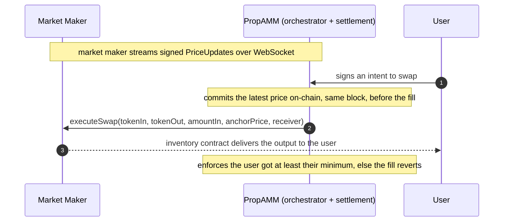

# Biconomy PropAMM: MM Integration

What a market maker implements to run a proprietary AMM on Biconomy PropAMM. There are two integration points and nothing else:

1. **A provider contract** you deploy, which holds your inventory and delivers your output.
2. **A signed price stream** you publish over WebSocket.

You stream prices and answer fills. Biconomy PropAMM submits the transactions and pays the gas.

> Biconomy PropAMM settles user intents and handles all the on-chain execution against your inventory. This document is your side of it: the small surface you implement to plug in.

---

## 1. The provider contract

You deploy one contract that holds your `tokenOut` inventory and exposes a single fill hook. It implements three functions.

```solidity
interface IMMProvider {
    // The address whose key signs your price updates. EOA or EIP-1271 contract.
    function signer() external view returns (address);

    // Off-chain quote helper. Returns the output your executeSwap would deliver for these
    // inputs right now, so quotes reflect what the user will actually receive.
    function previewSwap(
        address tokenIn,
        address tokenOut,
        uint256 amountIn,
        uint256 anchorPrice
    ) external view returns (uint256 amountOut);

    // The fill. Pull amountIn from the caller, deliver your chosen output to receiver.
    function executeSwap(
        address tokenIn,
        address tokenOut,
        uint256 amountIn,
        uint256 anchorPrice,
        address receiver
    ) external returns (uint256 delivered);
}
```

### executeSwap

`executeSwap` performs the fill:

1. Require `msg.sender == approvedExecutor`.
2. Pull `amountIn` of `tokenIn` from the caller.
3. Compute the output from `anchorPrice` (the committed same-block price, 1e18-scaled as tokenOut per tokenIn) and any pricing logic you apply.
4. Send that `tokenOut` from inventory to `receiver` and return the amount.

The settlement contract does not compute or cap the output. With no curve it is `amountIn * anchorPrice / 1e18`; with a curve, apply it here and return the same value from `previewSwap` so quotes match execution.

A minimal reference implementation:

```solidity
function executeSwap(
    address tokenIn,
    address tokenOut,
    uint256 amountIn,
    uint256 anchorPrice,
    address receiver
) external returns (uint256 delivered) {
    require(msg.sender == approvedExecutor, "not executor");
    SafeTransferLib.safeTransferFrom(tokenIn, msg.sender, address(this), amountIn);
    delivered = (amountIn * anchorPrice) / 1e18;   // your pricing goes here
    SafeTransferLib.safeTransfer(tokenOut, receiver, delivered);
}
```

### Onboarding

1. Deploy your provider with `(signer, executor, owner)`. `executor` is the `PropAMMExecutor` address for the chain (addresses in section 3); the constructor sets it as your `approvedExecutor`.
2. Fund the contract with `tokenOut` inventory for every pair you quote.
3. Share three things with the Biconomy team: your signer address, your provider contract address, and the token pairs you quote per chain. The orchestrator only accepts price updates from registered signers and only routes fills over registered pairs, so this step gates everything.
4. Start streaming signed prices (next section).

There is no on-chain registration step. Registration is orchestrator-side only, per the list you share in step 3.

### Key rotation

- Rotate your signing key with `setSigner(newSigner)`, one owner transaction. Later price updates must be signed by the new key.
- Rotate the trusted executor with `setApprovedExecutor(newExecutor)`, one owner transaction. Use an owner multisig in production.

---

## 2. The price stream

You publish signed `PriceUpdate` messages over a WebSocket. Each is an EIP-712 typed message.

```solidity
struct PriceUpdate {
    address mm;         // your signer; must match provider.signer()
    address tokenIn;
    address tokenOut;
    uint256 price;      // 1e18-scaled, tokenOut-wei per tokenIn-wei (see below)
    uint256 nonce;      // monotonic per (mm, tokenIn, tokenOut)
    uint256 expiresAt;  // unix seconds, your wall-time validity cap
}
```

### Price is in raw token units

`price` converts raw amounts: `amountOut = amountIn * price / 1e18`, both sides in wei. When the two tokens have different decimals, fold the difference into the price:

```
price = humanPrice * 1e18 * 10^(decimalsOut - decimalsIn)
```

Example, WETH (18 decimals) to USDC (6 decimals) at 1,700 USDC per WETH: `price = 1700 * 1e18 * 10^(6-18) = 1700e6`. The inverse direction, USDC to WETH, is `(1/1700) * 1e18 * 10^(18-6) ≈ 5.88e26`. Same-decimals pairs reduce to the intuitive `humanPrice * 1e18`.

Signed against the `PropAMMExecutor` EIP-712 domain:

```
name:              "PropAMMExecutor"
version:           "1"
verifyingContract: <PropAMMExecutor address>
chainId:           <chain id>
```

### Stream both directions of a pair

Prices are directional. The anchor is keyed by `(signer, tokenIn, tokenOut)`, so `WETH -> USDC` and `USDC -> WETH` are independent. To serve a pair both ways, stream both directions. A fill in a direction you are not streaming has no fresh anchor and cannot settle. If you only intend to serve one direction, stream only that one.

### Nonce hygiene

- Nonces are monotonic per `(signer, tokenIn, tokenOut)`, independently per direction. Do not reuse.
- A price update with a nonce at or below the latest committed one is ignored on-chain, so a delayed update can never overwrite a fresher one.
- Publish at a steady cadence. The fresher your stream, the more flow you can serve at any moment.

### Your price commits inside the settlement transaction

Your price commits to the chain inside the same transaction that settles the user's fill, before the fill, in the same block. You sign and stream; Biconomy PropAMM does the on-chain commit and submission.

---

## 3. Connect to the live API

A staging environment is live for integration on both chains:

| | |
|---|---|
| REST | `https://propamm-staging.biconomy.io/v1` |
| WebSocket | `wss://propamm-staging.biconomy.io` (same host, any path) |
| Chains | Base Sepolia (84532, test tokens) and Base mainnet (8453) |

`PropAMMExecutor` addresses for the EIP-712 domain:

| Chain | Executor |
|---|---|
| Base Sepolia (84532) | `0xaBFb38a1FAd840531a85Bbfbe846BdBdb3B87801` |
| Base mainnet (8453) | `0x9726D555b28223f2F69d5086BEde1e21567a77c3` |

For Base Sepolia testing, the registered test tokens are mintable by anyone: MockWETH `0xD610F4f60eaF8cacfE2d5782419E7F3235F07c8C`, MockUSDC `0x1DFE288b8f39CFc80031aFE7619849B6289eA2AF` (both 18 decimals, `mint(address,uint256)`).

### Wire protocol

Messages are JSON text frames. `uint256` values are decimal strings. `signature` is the 65-byte `r || s || v` hex string.

Open a connection, subscribe once for your signer, then stream:

```jsonc
// 1. you -> server, once per connection
{ "type": "subscribe", "data": { "type": "price-ledger", "mm": "0xYourSigner" } }
// server -> you
{ "type": "ack" }

// 2. you -> server, per price update
{
  "type": "price-ledger-update",
  "payload": {
    "mm": "0xYourSigner",
    "tokenIn": "0x...",
    "tokenOut": "0x...",
    "price": "1700000000",
    "nonce": "1783005487346",
    "expiresAt": "1783005517",
    "signature": "0x...",
    "chainId": 8453
  }
}
// server -> you, per update
{ "type": "ack" }
// or on rejection
{ "type": "error", "code": "...", "message": "..." }
```

Notes:

- `chainId` selects the EIP-712 domain the signature is verified against. One connection can carry updates for multiple chains.
- One signer per connection: every update's `mm` must match the subscribed `mm`. Run one connection per signing key.
- Updates are rejected before the subscribe handshake completes (`NOT_SUBSCRIBED`).
- Signatures are standard EIP-712: any `signTypedData` implementation works (viem, ethers). No custom hashing.
- Unix milliseconds make a good nonce: monotonic, and independent nonce spaces per pair-direction mean the same value can be reused across pairs in one tick.
- The server sends protocol-level WebSocket pings. Standard libraries answer them automatically; if you hand-roll a client, respond or the idle reaper drops you.

### Minimal client

A complete streaming client, verified against the live staging API. One pair, one direction; extend the loop for more.

```ts
import WebSocket from "ws";
import { privateKeyToAccount } from "viem/accounts";

const ENDPOINT = "wss://propamm-staging.biconomy.io";
const CHAIN_ID = 84532;
const EXECUTOR = "0xaBFb38a1FAd840531a85Bbfbe846BdBdb3B87801"; // per-chain, see table above
const WETH = "0xD610F4f60eaF8cacfE2d5782419E7F3235F07c8C";
const USDC = "0x1DFE288b8f39CFc80031aFE7619849B6289eA2AF";

const account = privateKeyToAccount(process.env.MM_SIGNER_KEY as `0x${string}`);

const TYPES = {
  PriceUpdate: [
    { name: "mm", type: "address" },
    { name: "tokenIn", type: "address" },
    { name: "tokenOut", type: "address" },
    { name: "price", type: "uint256" },
    { name: "nonce", type: "uint256" },
    { name: "expiresAt", type: "uint256" },
  ],
} as const;

const ws = new WebSocket(ENDPOINT);
ws.on("open", () =>
  ws.send(JSON.stringify({ type: "subscribe", data: { type: "price-ledger", mm: account.address } })),
);
ws.on("message", (m) => console.log(m.toString()));

setInterval(async () => {
  if (ws.readyState !== WebSocket.OPEN) return;
  const price = 1700n * 10n ** 18n; // your pricing goes here (both tokens 18 decimals)
  const nonce = BigInt(Date.now());
  const expiresAt = nonce / 1000n + 30n;
  const signature = await account.signTypedData({
    domain: { name: "PropAMMExecutor", version: "1", chainId: BigInt(CHAIN_ID), verifyingContract: EXECUTOR },
    types: TYPES,
    primaryType: "PriceUpdate",
    message: { mm: account.address, tokenIn: WETH, tokenOut: USDC, price, nonce, expiresAt },
  });
  ws.send(JSON.stringify({
    type: "price-ledger-update",
    payload: {
      mm: account.address, tokenIn: WETH, tokenOut: USDC,
      price: price.toString(), nonce: nonce.toString(), expiresAt: expiresAt.toString(),
      signature, chainId: CHAIN_ID,
    },
  }));
}, 1000);
```

### Error codes

Every rejected update gets an `error` frame. The full set:

| Code | Meaning | Fix |
|---|---|---|
| `NOT_SUBSCRIBED` | update sent before the subscribe ack | subscribe first, wait for `ack` |
| `MARKET_MAKER_MISMATCH` | payload `mm` differs from the subscribed `mm` | one signer per connection |
| `UNREGISTERED_MARKET_MAKER` | signer not registered with the orchestrator | complete onboarding step 3 |
| `UNSUPPORTED_PAIR` | pair not registered for your MM on that chain | register the pair, check addresses and chainId |
| `INVALID_SIGNATURE` | recovered signer does not match `mm` | check domain values, especially executor address and chainId |
| `UPDATE_EXPIRED` | `expiresAt` already in the past | clock skew or TTL too short |
| `STALE_NONCE` | nonce at or below the last accepted one for this pair-direction | keep nonces monotonic; unix ms works |
| `RATE_LIMITED` | over 300 messages/s on the connection | back off |
| `INVALID_JSON` / `INVALID_MESSAGE` | malformed frame or schema mismatch | check encoding rules above |
| `INVALID_TOKEN_PAIR` | `tokenIn` equals `tokenOut` | fix the pair |
| `STORE_FAILED` | transient server-side failure | safe to continue; the next update supersedes |

### Limits and hygiene

| Item | Value |
|---|---|
| Rate limit | 300 messages/s per connection |
| Max message size | 64 KB |
| Idle timeout | connections without traffic for 60 s are closed; reconnect and re-subscribe |
| Suggested cadence | 100 to 1000 ms per pair-direction |
| Suggested `expiresAt` | now + 15 to 60 s; expired updates are rejected |

### Verify your integration

Your stream is live when the quote endpoint prices against it:

```
GET /v1/health                  -> chains and status
GET /v1/market-makers           -> your signer should be listed after registration
GET /v1/quote?chainId=...&tokenIn=...&tokenOut=...&amountIn=...&trader=...
                                -> amountOut derived from your latest update
```

A quote returning `No routes found` means no fresh anchor for that pair-direction: not registered, not streaming, or expired updates.

---

## 4. One fill



---

## Reference

- ERC-8211 standard: <https://erc8211.com/>
