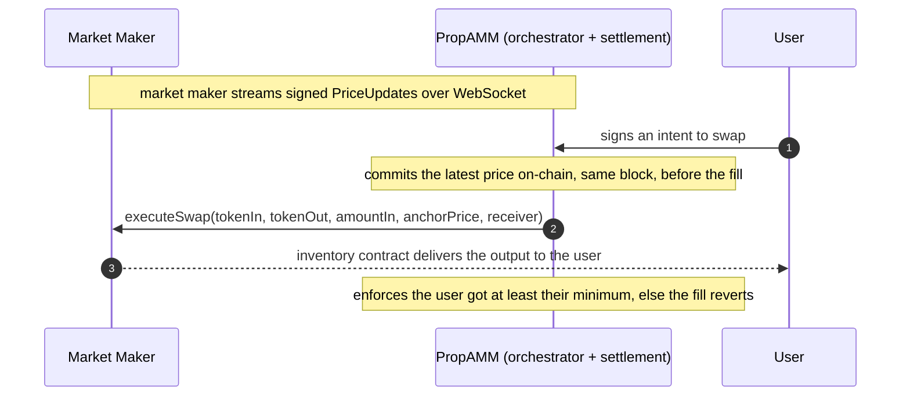

# Biconomy PropAMM: MM Integration

What a market maker implements to run a proprietary AMM on Biconomy PropAMM. There are two integration points and nothing else:

1. **A provider contract** you deploy, which holds your inventory and delivers your output.
2. **A signed price stream** you publish over WebSocket.

You stream prices and answer fills. Biconomy PropAMM submits the transactions and pays the gas.

> Biconomy PropAMM settles user intents and handles all the on-chain execution against your inventory. This document is your side of it: the small surface you implement to plug in.

---

## 1. The provider contract

You deploy one contract that holds your `tokenOut` inventory and exposes a single fill hook. It implements three functions.

```solidity
interface IMMProvider {
    // The address whose key signs your price updates. EOA or EIP-1271 contract.
    function signer() external view returns (address);

    // Off-chain quote helper. Returns the output your executeSwap would deliver for these
    // inputs right now, so quotes reflect what the user will actually receive.
    function previewSwap(
        address tokenIn,
        address tokenOut,
        uint256 amountIn,
        uint256 anchorPrice
    ) external view returns (uint256 amountOut);

    // The fill. Pull amountIn from the caller, deliver your chosen output to receiver.
    function executeSwap(
        address tokenIn,
        address tokenOut,
        uint256 amountIn,
        uint256 anchorPrice,
        address receiver
    ) external returns (uint256 delivered);
}
```

### executeSwap

`executeSwap` performs the fill:

1. Require `msg.sender == approvedExecutor`.
2. Pull `amountIn` of `tokenIn` from the caller.
3. Compute the output from `anchorPrice` (the committed same-block price, 1e18-scaled as tokenOut per tokenIn) and any pricing logic you apply.
4. Send that `tokenOut` from inventory to `receiver` and return the amount.

The settlement contract does not compute or cap the output. With no curve it is `amountIn * anchorPrice / 1e18`; with a curve, apply it here and return the same value from `previewSwap` so quotes match execution.

A minimal reference implementation:

```solidity
function executeSwap(
    address tokenIn,
    address tokenOut,
    uint256 amountIn,
    uint256 anchorPrice,
    address receiver
) external returns (uint256 delivered) {
    require(msg.sender == approvedExecutor, "not executor");
    SafeTransferLib.safeTransferFrom(tokenIn, msg.sender, address(this), amountIn);
    delivered = (amountIn * anchorPrice) / 1e18;   // your pricing goes here
    SafeTransferLib.safeTransfer(tokenOut, receiver, delivered);
}
```

### Onboarding

1. Deploy your provider with `(signer, executor, owner)`. `executor` is the `PropAMMExecutor` address; the constructor sets it as your `approvedExecutor`.
2. Fund the contract with `tokenOut` inventory for every pair you quote.
3. Start streaming signed prices (next section).

There is no on-chain registration step.

### Key rotation

- Rotate your signing key with `setSigner(newSigner)`, one owner transaction. Later price updates must be signed by the new key.
- Rotate the trusted executor with `setApprovedExecutor(newExecutor)`, one owner transaction. Use an owner multisig in production.

---

## 2. The price stream

You publish signed `PriceUpdate` messages over a WebSocket. Each is an EIP-712 typed message.

```solidity
struct PriceUpdate {
    address mm;         // your signer; must match provider.signer()
    address tokenIn;
    address tokenOut;
    uint256 price;      // 1e18-scaled, tokenOut per tokenIn
    uint256 nonce;      // monotonic per (mm, tokenIn, tokenOut)
    uint256 expiresAt;  // unix seconds, your wall-time validity cap
}
```

Signed against the `PropAMMExecutor` EIP-712 domain:

```
name:              "PropAMMExecutor"
version:           "1"
verifyingContract: <PropAMMExecutor address>
chainId:           <chain id>
```

### Stream both directions of a pair

Prices are directional. The anchor is keyed by `(signer, tokenIn, tokenOut)`, so `WETH -> USDC` and `USDC -> WETH` are independent. To serve a pair both ways, stream both directions. A fill in a direction you are not streaming has no fresh anchor and cannot settle. If you only intend to serve one direction, stream only that one.

### Nonce hygiene

- Nonces are monotonic per `(signer, tokenIn, tokenOut)`, independently per direction. Do not reuse.
- A price update with a nonce at or below the latest committed one is ignored on-chain, so a delayed update can never overwrite a fresher one.
- Publish at a steady cadence. The fresher your stream, the more flow you can serve at any moment.

### Your price commits inside the settlement transaction

Your price commits to the chain inside the same transaction that settles the user's fill, before the fill, in the same block. You sign and stream; Biconomy PropAMM does the on-chain commit and submission.

---

## 3. One fill



---

## Reference

- ERC-8211 standard: <https://erc8211.com/>
