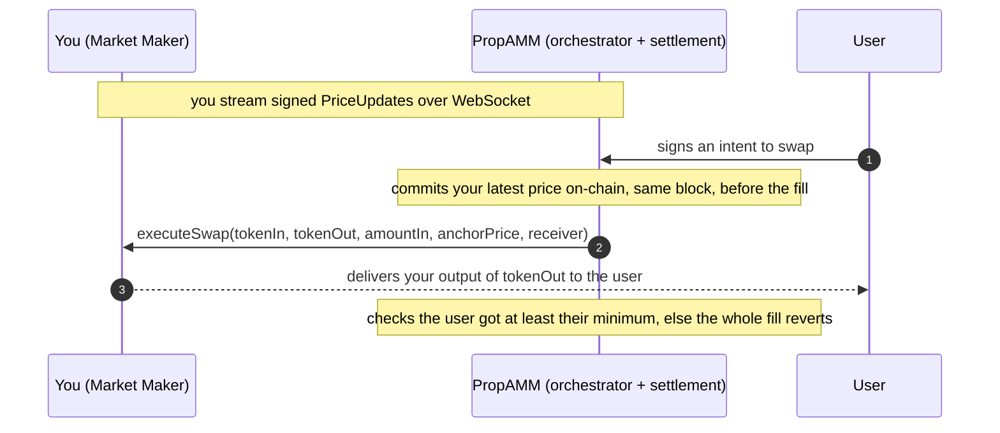

# PropAMM MM Integration

What a market maker implements to go live. There are two integration points and nothing else:

1. **A provider contract** you deploy, which holds your inventory and delivers your output.
2. **A signed price stream** you publish over WebSocket.

You never send transactions, pay gas, or build routes. You stream prices and answer fills.

> Aggregator and wallet integration (routing user orders through our orchestrator API) is a separate track and is still being finalised. This document covers the MM integration, which is stable at the contract level today.

---

## 1. The provider contract

You deploy one contract that holds your `tokenOut` inventory and exposes a single fill hook. It implements three functions.

```solidity
interface IMMProvider {
    // The address whose key signs your price updates. EOA or EIP-1271 contract.
    function signer() external view returns (address);

    // Off-chain quote helper. Returns the output your executeSwap would deliver for these
    // inputs right now, so routing reflects what the user will actually receive.
    function previewSwap(
        address tokenIn,
        address tokenOut,
        uint256 amountIn,
        uint256 anchorPrice
    ) external view returns (uint256 amountOut);

    // The fill. Pull amountIn from the caller, deliver your chosen output to receiver.
    function executeSwap(
        address tokenIn,
        address tokenOut,
        uint256 amountIn,
        uint256 anchorPrice,
        address receiver
    ) external returns (uint256 delivered);
}
```

### executeSwap: you own the pricing

`executeSwap` is the only place your contract does work. The flow inside it:

1. Require `msg.sender == approvedExecutor`. This is your entire security boundary. Only the executor you trust can call you.
2. Pull `amountIn` of `tokenIn` from the caller.
3. Compute the output you want to deliver from `anchorPrice` (the fresh, same-block price, 1e18-scaled as tokenOut per tokenIn) plus any curve, spread, or inventory logic of your own.
4. Send that output of `tokenOut` from your inventory to `receiver`, and return the amount.

You decide the output. The protocol does not price the trade for you and imposes no cap on what you deliver. A minimal MM with no curve just returns `amountIn * anchorPrice / 1e18`. An MM with a curve applies it here, and implements `previewSwap` to return the same number so routing quotes match execution.

A minimal reference implementation:

```solidity
function executeSwap(
    address tokenIn,
    address tokenOut,
    uint256 amountIn,
    uint256 anchorPrice,
    address receiver
) external returns (uint256 delivered) {
    require(msg.sender == approvedExecutor, "not executor");
    SafeTransferLib.safeTransferFrom(tokenIn, msg.sender, address(this), amountIn);
    delivered = (amountIn * anchorPrice) / 1e18;   // your pricing goes here
    SafeTransferLib.safeTransfer(tokenOut, receiver, delivered);
}
```

### Onboarding

1. Deploy your provider with `(signer, executor, owner)`. `executor` is the `PropAMMExecutor` address; the constructor sets it as your `approvedExecutor`.
2. Fund the contract with `tokenOut` inventory for every pair you quote.
3. Start streaming signed prices (next section).

There is no on-chain registration step.

### Key rotation

- Rotate your signing key with `setSigner(newSigner)`, one owner transaction. Later price updates must be signed by the new key.
- Rotate the trusted executor with `setApprovedExecutor(newExecutor)`, one owner transaction. Use an owner multisig in production.

---

## 2. The price stream

You publish signed `PriceUpdate` messages over a WebSocket. Each is an EIP-712 typed message.

```solidity
struct PriceUpdate {
    address mm;         // your signer; must match provider.signer()
    address tokenIn;
    address tokenOut;
    uint256 price;      // 1e18-scaled, tokenOut per tokenIn
    uint256 nonce;      // monotonic per (mm, tokenIn, tokenOut)
    uint256 expiresAt;  // unix milliseconds, your wall-time validity cap
}
```

Signed against the `PropAMMExecutor` EIP-712 domain:

```
name:              "PropAMMExecutor"
version:           "1"
verifyingContract: <PropAMMExecutor address>
chainId:           <chain id>
```

### Nonce hygiene

- Nonces are monotonic per `(signer, tokenIn, tokenOut)`. Do not reuse.
- A price update with a nonce at or below the latest committed one is ignored on-chain, so a delayed update can never overwrite a fresher one.
- Publish at a steady cadence. The fresher your stream, the more flow you can serve at any moment.

### You never land transactions

Your price commits to the chain inside the same transaction that settles the user's fill, committed before the fill in the same block. You only sign and stream. The freshness guarantee (next section) is enforced for you.

---

## 3. One fill, from your point of view



What this gives you:

- **Same-block price freshness.** The settlement contract requires that the price your fill settles against was committed in the same block. A stale price cannot be used against you. This is what removes the toxic-flow pickoff that makes permissionless propAMMs unviable on L2s.
- **You own output pricing.** The executor passes your fresh price and your input; you decide and deliver the output.
- **The user is protected, so you are not exposed to bad fills.** Settlement enforces the user's signed minimum. If your output is below it, the fill reverts and nothing moves. You never deliver into a fill that would not also satisfy the user.
- **Your signing key is the only sensitive surface.** Only your `approvedExecutor` can call `executeSwap`, and your owner key controls both that and rotations.

---

## Reference

- `bcnmy/propamm-protocol`: settlement, executor, and MM provider templates (`BasicMMProvider`, `DriftedMMProvider`)
- ERC-8211 standard: <https://erc8211.com/>
